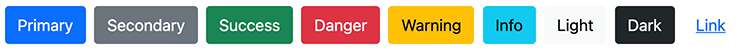
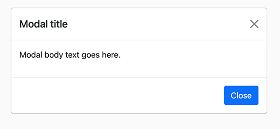

# Bootstrap 5

> This project is a Bootstrap 5 implementation of http://getbootstrap.com for the Digital Experience Platform.

## Installation

Bootstrap 5 is made of several modules:

-   **bootstrap5-core**: This module contains all assets (CSS and JS files), and also the main mixin `bootstrap5mix:component` which is used on all bootstrap components. \
    This module also contains the component *Version* that display the embedded version of bootstrap in an alert box, on edit mode.
-   **bootstrap5-components**: This module contains all the modules, definitions, views, and logic.
-   **bootstrap5-templates-starter**: This template set allows you to play with the Bootstrap 5 components. This template set provides an empty page but add the related dependencies, and supports the RTL.

### Installation using the Bootstrap 5 package

The easiest way to install Bootstrap 5 on your platform using the package. Please read the dedicated tutorial on [https://academy.jahia.com/training-kb/tutorials/administrators/installing-a-module](https://academy.jahia.com/training-kb/tutorials/administrators/installing-a-module) and select the **Bootstrap 5 package** from the store.

You can also get the latest version of this package directly from the GitHub repository https://github.com/Jahia/bootstrap5/releases/latest

### Manual installation

If you want to use the Bootstrap 5 components only, you can install `bootstrap5-core` and the `bootstrap5-components` modules to your Jahia, then enable at least the bootstrap5-components modules on your site. Please read the dedicated tutorial on https://academy.jahia.com/training-kb/tutorials/administrators/installing-a-module  for more information.

### Dependencies

The Bootstrap 5 modules have no external dependencies. Internally, here are the dependencies:

-   `bootstrap5-core` depends on the `default` module
-   `bootstrap5-components` depends on the `bootstrap5-core` module
-   `bootstrap5-templates-starter` depends on the `bootstrap5-components` module

If you want to create your own project and use the Bootstrap 5 components, you simply need to add a bootstrap5-components as a dependency. All components view will import the needed resources (CSS and/or JavaScript file)

_________________

## List of components

>The Bootstrap 5 components module provides a list of components that will allow you to use Bootstrap 5 without thinking about it, as all the logic and syntax will be done automatically.

### Accordions

This component builds vertically collapsing accordions in combination with the Bootstrap Collapse JavaScript plugin.


The node type Accordions `bootstrap5nt:accordions` is the main component. It will allow the user to create a list of Accordion (see below).

#### Accordions properties

Here is the list of properties for the Accordions component:

| Label | Name | Description | Default value |
| --- | --- | --- | --- |
| **Flush** | `flush` | This will remove the default background-color, some borders, and some rounded corners to render accordions edge-to-edge with their parent container. If this property is set, the component will look like this  | false | 

#### Accordions definition

Here is the definition of the Accordions component

```cnd
[bootstrap5nt:accordions] > jnt:content, bootstrap5mix:component, jmix:list, jmix:siteContent, jmix:browsableInEditorialPicker orderable
 - flush (boolean) = 'false' indexed=no
 + * (bootstrap5nt:accordion)
```

This component will create a list of nodes of type `bootstrap5nt:accordion`.

#### Accordion properties (sub-node)

On the Accordion `bootstrap5nt:accordion`, you can set the following properties:

| Label | Name | Description | Default value |
| --- | --- | --- | --- |
| **Title** | `jcr:title` | This property is used as the clickable element to expend the content of the accordion | | 
| **Show content** | `show` | if checked, the content of the accordion will be expanded as default | false | 

#### Accordions definition (sub-node)

Here is the definition of an accordion:

```cnd
[bootstrap5nt:accordion] > jnt:content, mix:title, bootstrap5mix:text
 - show (boolean) = 'false' indexed=no
 + * (jmix:droppableContent) = jmix:droppableContent
```

This node will allow you to add any content on the expanded part (the accordion body).

### Breadcrumb

Indicate the current page’s location within a navigational hierarchy that automatically adds separators via CSS. This will look like this:


#### Breadcrumb properties

-   **Custom Class(es) to set on this breadcrumb** `cssClass`: this property is available when enabling the Advanced settings (bootstrap5mix:advancedBreadcrumb). It will allow you to add a custom CSS to the main breadcrumb list.

#### Breadcrumb definition

Here is the full definition of the breadcrumb:
```cnd
[bootstrap5mix:advancedBreadcrumb] mixin
 extends = bootstrap5nt:breadcrumb
 itemtype = content
 - cssClass (string) = 'float-start' indexed=no

[bootstrap5nt:breadcrumb]> jnt:content, bootstrap5mix:component
```

### Button

This is a multifunction component that will allow several actions, by creating a button with multiple styles, sizes, and more.

#### Button properties

| Label | Name | Description | Default value |
| --- | --- | --- | --- |
| **Title**  | `jcr:title` |  the title will be used as the clickable label | | 
| **Action** | `buttonType` | this will provide a choice list of actions (see list below) | |

List of action:

-   An internal link or a URL
-   A collapsible content
-   A modal (dialog prompts)
-   A popover


#### Button advanced properties

A few advanced settings are only available when clicking on the Advanced settings `bootstrap5mix:buttonAdvancedSettings` mixin

| Label | Name | Description | Default value |
| --- | --- | --- | --- |
| **Style** | `style` | Pick a predefined styles: Primary, Secondary, Success, Info, Warning, Danger, No style (link only), Dark, Light or Custom   If the style is set to Custom, then only the CSS classes set on the Custom Class(es) to set on this button (cssClass) will be used on the button. | Primary |
| **Size** | `size` | Pick a size. It could be Default, Small or Large.  | Default| 
| **Outline** | `outline` |  In need of a button, but not the hefty background colors they bring  | false | 
| **Full width button** | `block` | Create responsive stacks of full-width, “block buttons”  | false | 
| **State** | `state` | Make buttons look active or disabled  | Default | 
| **Custom Class(es) to set on this button** | `cssClass` | This allows you to add any CSS classes on the button. | | 
| **Disable text wrapping** | `disableTextWrapping` | If you don’t want the button text to wrap | false | 
| **Stretched link** | `stretchedLink` | Make any HTML element or Bootstrap component clickable by “stretching” a nested link via CSS. As a result the link to make its containing block clickable. This for fine on components such a card or any component with a position relative (or with the class position-relative). Multiple links and tap targets are not recommended | false |

#### Button definition

Depending on the chosen action (buttonType), an initializer will add a mixin on the fly to the node. The mixin can be one of these (see full description below):

-   `bootstrap5mix:externalLink` for URL
-   `bootstrap5mix:internalLink` for Internal link
-   `bootstrap5mix:collapse` for Collaps
-   `bootstrap5mix:modal` for Modal
-   `bootstrap5mix:popover` for Popover

Here are the button and the advanced settings definitions
    
```cnd
[bootstrap5nt:button]> jnt:content, bootstrap5mix:component, mix:title
- buttonType (string, choicelist[buttonTypeInitializer, resourceBundle]) = 'internalLink' autocreated indexed=no < 'internalLink', 'externalLink', 'modal', 'collapse','popover'

[bootstrap5mix:buttonAdvancedSettings] mixin
extends = bootstrap5nt:button
itemtype = content
- style (string, choicelist[resourceBundle]) = 'primary' autocreated indexed=no < 'primary', 'secondary', 'success', 'info', 'warning', 'danger', 'link','dark','light','custom'
- size (string, choicelist[resourceBundle]) = 'default' autocreated indexed=no < 'default', 'btn-lg', 'btn-sm'
- outline (boolean) = 'false' indexed=no
- block (boolean) = 'false' indexed=no
- state (string, choicelist[resourceBundle]) = 'default' autocreated indexed=no < 'default', 'active', 'disabled'
- cssClass (string) indexed=no
- disableTextWrapping (boolean) = 'false' indexed=no
- stretchedLink (boolean) = 'false' indexed=no
```

#### Button: internal link 

Choose the action internal link to create a link to local content. This will add the mixin `bootstrap5mix:internalLink` to the button node.

#### Internal link Properties
| Label | Name | Description | Default value |
| --- | --- | --- | --- |
| **link** | `internalLink` | This can be any editorial content, or a page, or a file. | | 

#### Internal link definition

Here is the definition of the mixin `bootstrap5mix:internalLink`

```cnd
[bootstrap5mix:internalLink] > jmix:templateMixin mixin
extends = bootstrap5nt:button
- internalLink (weakreference, picker[type='editoriallink']) < jmix:droppableContent, jnt:page, jnt:file
```

#### Button: URL


Choose the action URL to create a link to any URL. This will add the mixin `bootstrap5mix:externalLink` to the button node.
#### URL Properties
| Label | Name | Description | Default value |
| --- | --- | --- | --- |
| URL | `externalLink`|  This can be any URL | https:// | 

#### URL definition

Here is the definition of the mixin `bootstrap5mix:externalLink`

```cnd
[bootstrap5mix:externalLink] > jmix:templateMixin mixin
extends = bootstrap5nt:button
- externalLink (string) = 'http://'
```

#### Button: Collapse

Choose the action Collapse to toggle the visibility of content. The buttons will be used as triggers that are mapped to specific elements you toggle. This will add the mixin `bootstrap5mix:collapse` to the button node. This action is similar to the accordion component

##### Collapse properties
| Label | Name | Description | Default value |
| --- | --- | --- | --- |
|Show content |`show`| if checked, the content of the collapse will be expanded as default (default is none)| false |

##### Collapse definition

Here is the definition of the mixin `bootstrap5mix:collapse`

```cnd
[bootstrap5mix:collapse] > jmix:templateMixin, jmix:browsableInEditorialPicker mixin orderable
extends = bootstrap5nt:button
- show (boolean) = 'false' indexed=no
+ * (jmix:droppableContent) = jmix:droppableContent
```

This node will allow you to add any content on the expanded part (the collapsed body).

#### Button: modal (dialog prompts)

Choose the action modal to prompt for a dialog. This will add the mixin `bootstrap5mix:modal` to the button node. 



##### Modal properties
| Label | Name | Description | Default value |
| --- | --- | --- | --- |
| **Title for the modal  header** |`modalTitle`| Optional title for the modal header | |
|  **Label for the close button** |`closeText`| Label used for the close button | Close |
|  **Size of the modal** |`modalSize`|  value can be the default one, Large, Small or Extra Large | Default |
|  **Static backdrop (the modal will not close when clicking outside it)** |`staticBackdrop`| When set, the modal | false | will not close when clicking outside it. Click the button below to try it.
|  **Vertically centered** |`verticallyCentered`| When set, vertically center the modal | false |

#### Modal definition

Here is the definition of the mixin `bootstrap5mix:modal`

```cnd
[bootstrap5mix:modal] > jmix:templateMixin, jmix:browsableInEditorialPicker mixin orderable
extends = bootstrap5nt:button
- modalTitle (string) i18n
- closeText (string) = 'Close' i18n
- modalSize (string, choicelist[resourceBundle]) = 'default' autocreated indexed=no < 'default', 'lg', 'sm', 'xl'
- staticBackdrop (boolean) = 'false' indexed=no
- verticallyCentered (boolean) = 'false' indexed=no
+ * (jmix:droppableContent) = jmix:droppableContent
```

This node will allow you to add any content to the modal body.

#### Button: Popover

Choose the action Popover display a popover. This will add the mixin `bootstrap5mix:popover` to the button node.


##### Popover properties

| Label | Name | Description | Default value |
| --- | --- | --- | --- |
|**Title of the popover** |`popoverTitle`| If not set, the title is ignored || 
|**Content** |`popoverContent`|Content pf the popover. This can be rich text or text with HTML tags|| 
|**Direction** |`direction`| Four options are available: top, right, bottom, and left-aligned. Directions are mirrored when using Bootstrap in RTL.|top| 
|**Insert HTML into the popover** |`html`| If not set, innerText property will be used to insert content into the DOM. Use text if you're worried about XSS attacks.|true|

##### Popover definition

Here is the definition of the mixin `bootstrap5mix:popover`

```cnd
[bootstrap5mix:popover] > jmix:templateMixin mixin
extends = bootstrap5nt:button
- popoverTitle (string) i18n
- popoverContent (string) i18n
- direction (string, choicelist[resourceBundle]) = 'top' autocreated indexed=no < 'top', 'left', 'right', 'bottom'
- html (boolean) = 'false' indexed=no
```

### Card

Bootstrap’s cards provide a flexible and extensible content container with multiple variants and options. It includes options for headers and footers, a wide variety of content, contextual background colors, and powerful display options.


#### Card properties

- **Title** `jct:title`: Title of the card (that goes to the card-header part)
- **Image** `bootstrap5mix:image` : An image can be added to the card
- **Heading for the title** `headerSize`: Allow to set a Header from H1 to H5 or none
- **Alignment** `textAlign`: Text Alignment for the full card. This can be Start (default), End or Center
- **Footer** `footer`:  Text to display a text on the footer

#### Card advanced properties
You can also add more advanced properties
- **Class(es) to set on this Card** `cssClass`: Allow to add a custom CSS on the `card`
- **Class(es) to set on the Card Body** `cardBodyCssClass`: Allow to add a custom CSS on the `card-body`
- **Allow any content on the footer** `freeFooter`: This allow to add any content on the footer part

#### Card colors
You can also customize the colors of the text, the background and the borders of your card

- **Background** `backgroundColor`: Allow choosing one of this color for the background: Default, Primary, Secondary, Success, Danger, Warning, Info, Light, Dark, White, Transparent
- **Text** `textColor`: Allow choosing one of this color for the text: Muted, Primary, Secondary, Success, Danger, Warning, Info, Light, Dark, White, Body, Black-50, White-50
- **Border** `borderColor`: Allow choosing one of this color for the border: Default, Primary, Secondary, Success, Danger, Warning, Info, Light, Dark, White

#### Definition
Here is the definition of the card:

```cnd
[bootstrap5mix:colors] mixin
extends = bootstrap5nt:card
itemtype = content
- backgroundColor (string, choicelist[resourceBundle]) = 'default' autocreated indexed=no < 'default','primary','secondary','success','danger','warning','info','light','dark','white','transparent'
- textColor (string, choicelist[resourceBundle]) = 'dark' autocreated indexed=no < 'muted','primary','secondary','success','danger','warning','info','light','dark','white','body','black-50','white-50'
- borderColor (string, choicelist[resourceBundle]) = 'default' autocreated indexed=no < 'default','primary','secondary','success','danger','warning','info','light','dark','white'

[bootstrap5nt:card]> jnt:content, bootstrap5mix:component, mix:title, jmix:list, bootstrap5mix:image, jmix:browsableInEditorialPicker
- headerSize (string, choicelist[resourceBundle]) = 'default' autocreated indexed=no < 'default', 'h1', 'h2', 'h3', 'h4', 'h5'
- textAlign (string, choicelist[resourceBundle]) = 'text-start' autocreated indexed=no < 'text-start', 'text-end', 'text-center'
- footer (string) i18n
+ * (jmix:droppableContent) = jmix:droppableContent

[bootstrap5mix:cardAdvancedSettings] mixin
extends = bootstrap5nt:card
itemtype = content
- cssClass (string) = 'card' indexed=no
- cardBodyCssClass (string) = 'card-body' indexed=no
- freeFooter (boolean) = 'false' indexed=no
```

### Carousel

A slideshow component for cycling through elements—images or slides of text—like a carousel.


#### Properties of the carousel

You can change the default settings of the carousel by updating the following properties:


- **Display controls** `useLeftAndRightControls` ; Add the previous and next controls (default is true)
- **Display indicators** `useIndicators`: You can also add the indicators to the carousel, alongside the controls, too.  (default is false)
- **Delay between automatically cycling (ms)** `interval`: change the amount of time to delay between automatically cycling to the next item (note that this is a global setting; delay can be set slide per slide)  (default is 5000ms)
- **React to keyboard events** `keyboard`: Whether the carousel should react to keyboard events  (default is true)
- **Pauses the cycling on hover** `pause`: If set, this will pause the cycling of the carousel on mouse enter and resumes the cycling of the carousel on mouse leave. If unset, hovering over the carousel won't pause it.  (default is true)
- **Autoplay the carousel** `ride`: start animating the carousel at page load (default is true)
- **Cycle continuously** `wrap`: Whether the carousel should cycle continuously or have hard stops (default is true)
- **Crossfade** `fade`: Animate slides with a fade transition instead of a slide (default is true)
- **Custom Class(es) to set the carousel** `carouselClass`: Allow to set a custom CSS class on the carousel
- **Variant** `variant`: Allow setting darker controls, indicators, and captions instead of the default one  (default is white).

#### Definition of the Carousel

Here is the definition of a carousel

```cnd
[bootstrap5mix:carouselAdvancedSettings] mixin
 extends = bootstrap5nt:carousel
 itemtype = content
 - useIndicators (boolean) = 'false' indexed=no
 - useLeftAndRightControls (boolean) = 'true' indexed=no
 - interval (long) = '5000' indexed=no
 - keyboard (boolean) = 'true' indexed=no
 - pause (boolean) = 'true' indexed=no
 - ride (boolean) = 'true' indexed=no
 - wrap (boolean) = 'true' indexed=no
 - fade (boolean) = 'true' indexed=no
 - carouselClass (string) indexed=no
 - variant (string, choicelist[resourceBundle]) = 'white' autocreated indexed=no   < 'white', 'dark'

[bootstrap5nt:carousel] > jnt:content, bootstrap5mix:component, jmix:list, jmix:siteContent, jmix:browsableInEditorialPicker orderable
 + * (bootstrap5nt:carouselItem)
```
This component will create a list of Slide of type `bootstrap5nt:carouselItem`.

#### Properties of a Slide
Here are the properties that you can set on each slide `bootstrap5nt:carouselItem`
- **Title** `jcr:title`: The title of the slide
- **Image** `image`: The image of the slide
- **Caption** `caption`: A text caption

Also, you can customize each slide by enabling the advanced properties

- **Color for Title title** `Color` You can set one of this color for the title: Muted, Primary, Secondary, Success, Danger, Warning, Info, Light, Dark, White, Body, Black-50, White-50
- **Color for caption** `captionColor`: You can set one of this color for the caption: Muted, Primary, Secondary, Success, Danger, Warning, Info, Light, Dark, White, Body, Black-50, White-50
- **Custom Class(es) to set the slide** `carouselItemClass`: You can set a custom CSS class on your carousel-item
- **Individual interval (delay in ms to the next item)** `interval`: You can change the default delay between 2 slides by setting an individual delay (default is 5000ms)


### Figure

Anytime you need to display a piece of content—like an image with an optional caption, consider using a figure.


#### Figure properties
A figure is made of an image, a caption. 
On the advanced properties, you can change the alignment of the caption.

- Caption `jcr:title`:  This optional caption will be display after the image
- Image `image`: The image to display
- Caption alignment `captionAlignment`: This advanced properties can change the alignment of the caption. Value can be Start (default), Center or End

#### Figure definition
Here is the definition of a figure
```cnd
[bootstrap5mix:figureAdvancedSettings] mixin
 extends = bootstrap5nt:figure
 itemtype = content
 - captionAlignment (string, choicelist[resourceBundle]) = 'text-start' autocreated indexed=no < 'text-start', 'text-center', 'text-end'

[bootstrap5nt:figure] > jnt:content, bootstrap5mix:component, bootstrap5mix:imageAdvanced, mix:title
```

#### Image advanced properties
There are a few advanced settings for the image

- Class(es) to set on this image `imageClass`: A custom CSS class can be set on the IMG tag
- Style(s) to set on this image `imageStyle`: Custom inline styles can be set on the image, in to the style attribute. For instance, if you set “width:100px” then it will add `style=”width:100px”` in the IMG tag.
- ID to set on this image `imageID`: Allow to add an id attribute to the IMG tag with this value
- Responsive image `responsive`: Checked by default, this will add the `img-fluid` class. This applies `max-width: 100%;` and `height: auto;` to the image so that it scales with the parent element
- Alignment `align`: Choose to align the image on Start (default), Center or End.
- alternate text `alt`. If not set a default alternate text with the name of the image will be used.
- Border-radius `borderRadius`: Add classes to an element to easily round its corners. Variants are Circle, No radius, Only on bottom, Only on end, Only on start, Only on top, Pill, Rounded \
   
- Border-radius size `borderRadiusSize`: Use the scaling classes for larger or smaller rounded corners. Variants are No radius (default) \
  
- Thumbnails `thumbnails`: In addition to the border-radius, you can use img-thumbnail to give an image a rounded 1px border appearance. \
  

#### Image definition
Here is the definition of the image
```cnd
[bootstrap5mix:imageAdvancedSettings]  mixin
 extends = bootstrap5mix:imageAdvanced
 itemtype = content
 - imageClass (string) indexed=no
 - imageStyle (string) indexed=no
 - imageID (string) indexed=no
 - responsive (boolean) = 'true' indexed=no
 - thumbnails (boolean) = 'false' indexed=no
 - align (string, choicelist[resourceBundle]) = 'default' autocreated indexed=no < 'default', 'start', 'end', 'center'
 - alt (string) i18n
 - borderRadius (string, choicelist[resourceBundle]) = 'rounded-0' autocreated indexed=no < 'rounded','rounded-top', 'rounded-end', 'rounded-bottom','rounded-start','rounded-circle','rounded-pill','rounded-0'
 - borderRadiusSize (string, choicelist[resourceBundle]) = 'default' < 'default','rounded-0','rounded-1','rounded-2','rounded-3'

[bootstrap5mix:imageAdvanced] > bootstrap5mix:image mixin

[bootstrap5mix:image] mixin
 - image (weakreference, picker[type='image']) < 'jmix:image'
```

### Layout and Grid

Bootstrap’s grid system uses a series of containers, rows, and columns to layout and align content. It’s built with flexbox and is fully responsive.

In bootstrap, a standard layout is made of HTML5 Element > Container > Row > Columns and could look like this
```html
<section id="copyright">
    <div class="container">
        <div class="row">
            <div class="col">
                1 of 2
            </div>
            <div class="col">
                2 of 2
            </div>
        </div>
    </div>
</main>
```

This complex component will allow to generate any type of layout, by enabling different mixins. In the content editor, it looks like this:


Let’ see the different mixin in detail.

#### Layout and Grid: Create HTML5 Semantic Elements

This part will create a HTML5 Semantic.

Here are the properties of the mixin Create HTML5 Semantic Elements `bootstrap5mix:createSection`

- **Html element type** `sectionElement`: Select the HTML element to use: section, article, aside, hgroup, header, footer, aside, nav, div, figure, figcaption, main.
- **ID set on this HTML element** `sectionId`: This optional property will create an `id` attribute on the HTML Element (ex: `<section id="copyright">`)
- **Class(es) set on this HTML element** `sectionCssClass`: This optional property will add a `class` attribute on the Html Element with the value (ex: `<div class="doc">`)
- **Style** `sectionStyle`: This optional property will add a `style` attribute on the Html Element with the value (ex: `<div style="background-color:pink">`)
- **Aria** `sectionAria`: This optional property will add an `aria-label` attribute on the Html Element with the value (ex: `<div aria-label="projects">`)

Here is the definition of this mixin

```cnd
[bootstrap5mix:createSection] mixin
extends = bootstrap5nt:grid
itemtype = content
- sectionElement (string, choicelist[resourceBundle]) = 'div' autocreated indexed=no < 'section', 'article', 'aside', 'hgroup', 'header', 'footer', 'aside', 'nav', 'div', 'figure', 'figcaption', 'main'
- sectionId (string) indexed=no < '[a-zA-Z0-9-_]+'
- sectionCssClass (string) indexed=no
- sectionStyle (string) indexed=no
- sectionRole (string) indexed=no
- sectionAria (string) indexed=no
```
#### Layout and Grid: Create Container

This part will create a bootstrap container. Containers are the most basic layout element in Bootstrap and are required when using the grid system.

Here is the different properties of the mixin Create Container `bootstrap5mix:createContainer`
Bootstrap comes with three different containers:

- **ID set on this container** `containerId`: This optional property will create an `id` attribute on the container (ex: `<div class=”container” id="copyright">`)
- **Class(es) set on this container** `containerCssClass`: This optional property will add a `class` attribute on the container with the value (ex: `<div class="container custom-class">`)
- Container width containerType : Bootstrap comes with three different containers. Fluid container, Fixed container and 100% wide until the breakpoint.

Here is the definition of this mixin
```cnd
[bootstrap5mix:createContainer] mixin
 extends = bootstrap5nt:grid
 itemtype = content
 - containerId (string) < '[a-zA-Z0-9-_]+'
 - containerCssClass (string) indexed=no
 - containerType (string, choicelist[resourceBundle]) = 'container' autocreated indexed=no < 'container', 'container-fluid', 'container-sm', 'container-md', 'container-lg', 'container-xl', 'container-xxl'
```

#### Layout and Grid: Create Row and Columns

This part will create a row with several options such as alignment, gutters. You can also choose the type of columns that you want to create. It can be one of predefined columns or custom ones. You can also not create any columns. The initializer will add on the fly the mixin `bootstrap5mix:predefinedGrid` or `bootstrap5mix:customGrid` to the curent node.

Here are the different properties of the mixin Create Row and Columns `bootstrap5mix:createRow`

- **Select the type of grid that you want to create** `typeOfGrid`: You can choose to create an *empty row (no column)*, a *predefined grid* or a *custom grid*. Depending on your choice a mixin will be added (see more details below)
- **ID set on this row** `rowId`: This optional property will create an `id` attribute on the row (ex: `<div class=”row” id="copyright">`)
- **Class(es) set on this row** `rowCssClass`: This optional property will add a `class` attribute on the row with the value (ex: `<div class="row custom-class">`)
- **Vertical alignment** `rowVerticalAlignment`: choose to align the content of the row on Top (default), Middle, or Bottom
- **Horizontal alignment** `rowHorizontalAlignment`: Choose to align the content on Start, Center, End or Around, Between, Evenly (similar to around with equal space on the edges) 'justify-content-end','justify-content-around','justify-content-between','justify-content-evenly'
- **Horizontal Gutter (padding between your columns)** `horizontalGutters`: Choose a value between 0 (no gutter) and 5 (large) or use the default one
- **Vertical Gutter (padding between your rows)** `verticalGutters`: Choose a value between 0 (no gutter) and 5 (large) or use the default one

##### Type of grid: Empty row (no column)
This will create a row with no columns.

##### Type of grid: The predefined grid
The predefined grid will propose a few pre mashed grids. As you know, there are 12 template columns available per row, allowing you to create different combinations of elements that span any number of columns.  The predefined columns will propose the following layouts:

- 12 (one single column)
- 6 / 6 (2 equal columns)
- 4 / 4 / 4  (3 equal columns)
- 3 / 3 / 3 / 3  (4 equal columns)

and also a few other ones _

- 10 / 2 and 2 / 10 (a very smal and a extra large)
- 3 / 9 and 9 / 3 (a smal and a large)
- 4 / 8 and  8 / 4 (another smal and a large)
- 3 / 6 / 3 (a large with 2 small)

Each time the breakpoint used is made for the medium breakpoint (≥768px). So for instance, if you choose the layout 4 / 8, then the component will generate the following code:
```html
<div class=”row”>
    <div class="col-md-4">col 1</div>
    <div class="col-md-8">col 2</div>
</div>
```
Note that if you use an RTL language, then the first column will be in the first position.

##### Type of grid: The custom grid
For the custom grid, you can use any bootstrap compliant classes and use the `,` as a separator between 2 columns.

So if you use this value `col col-md-8,col-6 col-md-4` then the component will generate the following code:

```html
<div class=”row”>
    <div class="col col-md-8">col 1</div>
    <div class="col-6 col-md-4">col 2</div>
</div>
```
So as you can see there are no limits on it :-)

#### Layout and Grid: Create Row and Columns definition

Here is the definition for this mixin

```cnd
[bootstrap5mix:predefinedGrid] > jmix:templateMixin mixin
 extends = bootstrap5nt:grid
 - grid (string, choicelist[resourceBundle, moduleImage='png']) = '4_8' autocreated indexed=no < '2_10', '3_9', '4_8', '4_4_4', '3_6_3', '3_3_3_3', '6_6', '8_4', '9_3', '10_2', '12'

[bootstrap5mix:customGrid] > jmix:templateMixin mixin
 extends = bootstrap5nt:grid
 - gridClasses (string) = 'col col-md-8,col-6 col-md-4' indexed=no

[bootstrap5mix:createRow] mixin
 extends = bootstrap5nt:grid
 itemtype = content
 - typeOfGrid (string, choicelist[gridTypeInitializer, resourceBundle]) = 'nogrid' autocreated indexed=no < 'nogrid', 'predefinedGrid', 'customGrid'
 - rowId (string) < '[a-zA-Z0-9-_]+'
 - rowCssClass (string) indexed=no
 - rowVerticalAlignment (string, choicelist[resourceBundle]) = 'default' autocreated indexed=no < 'default', 'align-items-start', 'align-items-center', 'align-items-end'
 - rowHorizontalAlignment (string, choicelist[resourceBundle]) = 'default' autocreated indexed=no < 'default', 'justify-content-start', 'justify-content-center', 'justify-content-end','justify-content-around','justify-content-between','justify-content-evenly'
 - horizontalGutters (string, choicelist[resourceBundle]) = 'default' autocreated indexed=no < 'default','gx-0','gx-1','gx-2','gx-3','gx-4','gx-5'
 - verticalGutters (string, choicelist[resourceBundle]) = 'default' autocreated indexed=no < 'default','gy-0','gy-1','gy-2','gy-3','gy-4','gy-5'

```

### Navbar

The navbar provides simple navigation for your site


### Pagination

Indicate a series of related content exists across multiple pages.

### Text

This component provides bootstrap 4 styles and CK templates


### Version

Adds a div describing the bootstrap version used
