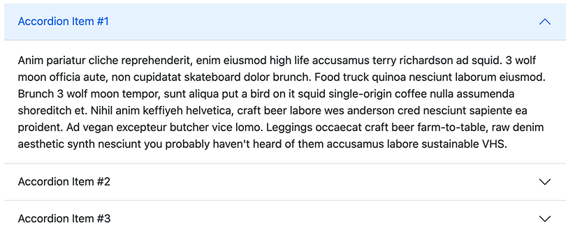
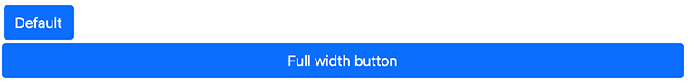

<!-- Copy and paste the converted output. -->
# Bootstrap 5

> This project is a Bootstrap 5 implementation of http://getbootstrap.com for the Digital Experience Platform.

## Installation/dependencies

Bootstrap 5 is made of several modules:

-   **bootstrap5-core**: This module contains all assets (CSS and JS files), and also the main mixin bootstrap5mix:component which is used on all bootstrap components. \
    This module also contains the component “Version” that display the embedded version of bootstrap, on edit mode.
-   **bootstrap5-components**: This module contains all the modules, definitions, views, and logic.
-   **bootstrap5-templates-starter**: This template set allows you to play with the Bootstrap 5 components. This template set provides an empty page but add the related dependencies, and supports the RTL

### Installation using the package

This is the easiest way to install Bootstrap 5 on your platform. Please read the dedicated tutorial on [https://academy.jahia.com/training-kb/tutorials/administrators/installing-a-module](https://academy.jahia.com/training-kb/tutorials/administrators/installing-a-module) and select the Bootstrap 5 package from the store.

You can also get the latest version of this package directly from the GitHub repository https://github.com/Jahia/bootstrap5/releases/latest

### Manual installation

If you want to use the Bootstrap 5 components modules, you can install only bootstrap5-core and the bootstrap5-components from the Jahia public store.

Deploy the bootstrap5-core and the bootstrap5-components modules to your Jahia, then enable at least the bootstrap5-components modules on your site. Please read the dedicated tutorial on https://academy.jahia.com/training-kb/tutorials/administrators/installing-a-module  for more information.

_________________

## Dependencies

The Bootstrap 5 modules have no external dependencies. Internally, here are the dependencies:

-   bootstrap5-core depends on the default module
-   bootstrap5-components depends on the bootstrap5-core component
-   bootstrap5-templates-starter depends on the bootstrap5-components module

If you want to create your own project and use the Bootstrap 5 components, you simply need to add a bootstrap5-components as a dependency. All components view will import the needed resources (CSS and/or JavaScript file)

_________________

## List of components

>The Bootstrap 5 components module provides a list of components that will allow you to use Bootstrap 5 without thinking about it, as all the logic and syntax will be done automatically.

### Accordions

This component builds vertically collapsing accordions in combination with the Bootstrap Collapse JavaScript plugin.


The node type Accordions `bootstrap5nt:accordions` is the main component. It will allow the user to create a list of Accordion (see below).

#### Accordions properties

Here is the list of properties for the Accordions component:

-   **Flush** `flush`: This will remove the default background-color, some borders, and some rounded corners to render accordions edge-to-edge with their parent container. The default value is none. \
    If this property is set, the component will look like this alt_text 
    

#### Accordions definition

Here is the definition of the Accordions component

```
[bootstrap5nt:accordions] > jnt:content, bootstrap5mix:component, jmix:list, jmix:siteContent, jmix:browsableInEditorialPicker orderable
 - flush (boolean) = 'false' indexed=no
 + * (bootstrap5nt:accordion)
```

This component will create a list of nodes of type bootstrap5nt:accordion.

#### Accordion properties (sub-node)

On the Accordion (bootstrap5nt:accordion), you can set the following properties:

*   **Title** `jcr:title`: This property is used as the clickable element to expend the content of the accordion.
*   **Show content** `show`: if checked, the content of the accordion will be expanded as default (default is none).

#### Accordions definition (sub-node)

Here is the definition of an accordion:

```
[bootstrap5nt:accordion] > jnt:content, mix:title, bootstrap5mix:text
 - show (boolean) = 'false' indexed=no
 + * (jmix:droppableContent) = jmix:droppableContent
```

This node will allow you to add any content on the expanded part (the accordion body).

### Breadcrumb

Indicate the current page’s location within a navigational hierarchy that automatically adds separators via CSS. This will look like this:


#### Breadcrumb properties

*   **Custom Class(es) to set on this breadcrumb** `cssClass`: this property is available when enabling the Advanced settings (bootstrap5mix:advancedBreadcrumb). It will allow you to add a custom CSS to the main breadcrumb list.

#### Breadcrumb definition

Here is the full definition of the breadcrumb:
```
[bootstrap5mix:advancedBreadcrumb] mixin
 extends = bootstrap5nt:breadcrumb
 itemtype = content
 - cssClass (string) = 'float-start' indexed=no

[bootstrap5nt:breadcrumb]> jnt:content, bootstrap5mix:component
```

### Button

This is a multifunction component that will allow several actions, by creating a button with multiple styles, sizes, and more.

#### Button properties

-   **Title** `jcr:title`: the title will be used as the clickable label
-   **Action** `buttonType`: this will provide a choice list of actions:
    -   An internal link or a URL
    -   A collapsible content
    -   A modal (dialog prompts)
    -   A popover


### Button advanced properties

A few advanced settings are only available when clicking on the Advanced settings `bootstrap5mix:buttonAdvancedSettings` mixin


-   **Style** `style`: pick a predefined styles: Primary, Secondary, Success, Info, Warning, Danger, No style (link only), Dark, Light or Custom
      \
    If the style is set to Custom, then only the CSS classes set on the Custom Class(es) to set on this button (cssClass) will be used on the button.
    
-   **Size** `size`: pick a size. It could be Default, Small or Large. \
    

-   **Outline** `outline`: In need of a button, but not the hefty background colors they bring
    

-   **Full width button** `block`: Create responsive stacks of full-width, “block buttons” \
    

-   **State** `state`:  Make buttons look active or disabled \
    

-   **Custom Class(es) to set on this button** `cssClass`: This allows you to add any CSS classes on the button.
-   **Disable text wrapping** `disableTextWrapping`: If you don’t want the button text to wrap
-   **Stretched link** `stretchedLink`: Make any HTML element or Bootstrap component clickable by “stretching” a nested link via CSS. As a result the link to make its containing block clickable. This for fine on components such a card or any component with a position relative (or with the class position-relative). Multiple links and tap targets are not recommended

### Button definition

Depending on the chosen action (buttonType), an initializer will add a mixin on the fly to the node. The mixin can be one of these (see full description below):

-   `bootstrap5mix:externalLink` for URL
-   `bootstrap5mix:internalLink` for Internal link
-   `bootstrap5mix:collapse` for Collaps
-   `bootstrap5mix:modal` for Modal
-   `bootstrap5mix:popover` for Popover

Here are the button and the advanced settings definitions
    
```
[bootstrap5nt:button]> jnt:content, bootstrap5mix:component, mix:title
- buttonType (string, choicelist[buttonTypeInitializer, resourceBundle]) = 'internalLink' autocreated indexed=no < 'internalLink', 'externalLink', 'modal', 'collapse','popover'

[bootstrap5mix:buttonAdvancedSettings] mixin
extends = bootstrap5nt:button
itemtype = content
- style (string, choicelist[resourceBundle]) = 'primary' autocreated indexed=no < 'primary', 'secondary', 'success', 'info', 'warning', 'danger', 'link','dark','light','custom'
- size (string, choicelist[resourceBundle]) = 'default' autocreated indexed=no < 'default', 'btn-lg', 'btn-sm'
- outline (boolean) = 'false' indexed=no
- block (boolean) = 'false' indexed=no
- state (string, choicelist[resourceBundle]) = 'default' autocreated indexed=no < 'default', 'active', 'disabled'
- cssClass (string) indexed=no
- disableTextWrapping (boolean) = 'false' indexed=no
- stretchedLink (boolean) = 'false' indexed=no
```

### Button: internal link 

Choose the action internal link to create a link to local content. This will add the mixin `bootstrap5mix:internalLink` to the button node.

#### Internal link Properties

-   **link** `internalLink`: This can be any editorial content, or a page, or a file. 

#### Internal link definition

Here is the definition of the mixin `bootstrap5mix:internalLink`

```
[bootstrap5mix:internalLink] > jmix:templateMixin mixin
extends = bootstrap5nt:button
- internalLink (weakreference, picker[type='editoriallink']) < jmix:droppableContent, jnt:page, jnt:file
```

### Button: URL


Choose the action URL to create a link to any URL. This will add the mixin `bootstrap5mix:externalLink` to the button node.
#### URL Properties

-   URL `externalLink`: This can be any URL

#### URL definition

Here is the definition of the mixin `bootstrap5mix:externalLink`

```
[bootstrap5mix:externalLink] > jmix:templateMixin mixin
extends = bootstrap5nt:button
- externalLink (string) = 'http://'
```

### Button: Collapse

Choose the action Collapse to toggle the visibility of content. The buttons will be used as triggers that are mapped to specific elements you toggle. This will add the mixin `bootstrap5mix:collapse` to the button node. This action is similar to the accordion component

#### Collapse properties

-   Show content `show`: if checked, the content of the collapse will be expanded as default (default is none).

#### Collapse definition

Here is the definition of the mixin `bootstrap5mix:collapse`

```
[bootstrap5mix:collapse] > jmix:templateMixin, jmix:browsableInEditorialPicker mixin orderable
extends = bootstrap5nt:button
- show (boolean) = 'false' indexed=no
+ * (jmix:droppableContent) = jmix:droppableContent
```

This node will allow you to add any content on the expanded part (the collapsed body).

### Button: modal (dialog prompts)

Choose the action modal to prompt for a dialog. This will add the mixin `bootstrap5mix:modal` to the button node. 


#### Modal properties

-   **Title for the modal header** `modalTitle`
-   **Label for the close button** `closeText`
-   **Size of the modal** `modalSize`:  value can be the default one, Large, Small or Extra Large
-   **Static backdrop (the modal will not close when clicking outside it)** `staticBackdrop`: When set, the modal will not close when clicking outside it. Click the button below to try it.
-   **Vertically centered** `verticallyCentered`: When set, vertically center the modal

#### Modal definition

Here is the definition of the mixin `bootstrap5mix:modal`

```
[bootstrap5mix:modal] > jmix:templateMixin, jmix:browsableInEditorialPicker mixin orderable
extends = bootstrap5nt:button
- modalTitle (string) i18n
- closeText (string) = 'Close' i18n
- modalSize (string, choicelist[resourceBundle]) = 'default' autocreated indexed=no < 'default', 'lg', 'sm', 'xl'
- staticBackdrop (boolean) = 'false' indexed=no
- verticallyCentered (boolean) = 'false' indexed=no
+ * (jmix:droppableContent) = jmix:droppableContent
```

This node will allow you to add any content to the modal body.


### Button: Popover

Choose the action Popover display a popover. This will add the mixin `bootstrap5mix:popover` to the button node.


#### Popover properties

-   **Title of the popover** `popoverTitle`: If not set, the title is ignored
-   **Content** `popoverContent`
-   **Direction** `direction`: Four options are available: top, right, bottom, and left-aligned. Directions are mirrored when using Bootstrap in RTL.
-   **Insert HTML into the popover** `html`: If not set, innerText property will be used to insert content into the DOM. Use text if you're worried about XSS attacks.

#### Popover definition

Here is the definition of the mixin `bootstrap5mix:popover`

```
[bootstrap5mix:popover] > jmix:templateMixin mixin
extends = bootstrap5nt:button
- popoverTitle (string) i18n
- popoverContent (string) i18n
- direction (string, choicelist[resourceBundle]) = 'top' autocreated indexed=no < 'top', 'left', 'right', 'bottom'
- html (boolean) = 'false' indexed=no
```

## Card

Bootstrap’s cards provide a flexible and extensible content container with multiple variants and options. It includes options for headers and footers, a wide variety of content, contextual background colors, and powerful display options.


## Carousel

A slideshow component for cycling through elements—images or slides of text—like a carousel.


## Figure

Anytime you need to display a piece of content—like an image with an optional caption, consider using a figure.


## Grid

Bootstrap’s grid system uses a series of containers, rows, and columns to layout and align content. It’s built with flexbox and is fully responsive.


## Navbar

The navbar provides simple navigation for your site


## Pagination

Indicate a series of related content exists across multiple pages.


## Text

This component provides bootstrap 4 styles and CK templates


## Version

Adds a div describing the bootstrap version used
