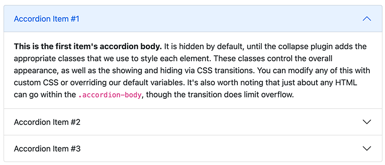
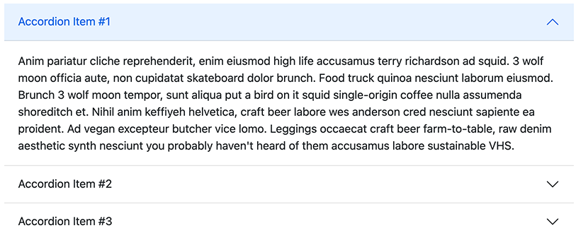

# Accordions properties

> This component builds vertically collapsing accordions in combination with the Bootstrap Collapse JavaScript plugin.



The node type Accordions `bootstrap5nt:accordions` is the main component. It will allow the user to create a list of Accordion (see below).

Here is the generated html:

````html
<div class="accordion" id="accordionExample">
    [accortions here]
</div>
````
## Properties

Here is the list of properties for the Accordions component:

| Label | Name | Description | Default value |
| --- | --- | --- | --- |
| **Flush** | `flush` | This will remove the default background-color, some borders, and some rounded corners to render accordions edge-to-edge with their parent container. If this property is set, the component will look like this  | false | 

## Definition

Here is the definition of the Accordions component

```cnd
[bootstrap5nt:accordions] > jnt:content, bootstrap5mix:component, jmix:list, jmix:siteContent, jmix:browsableInEditorialPicker orderable
 - flush (boolean) = 'false' indexed=no
 + * (bootstrap5nt:accordion)
```

This component will create a list of nodes of type `bootstrap5nt:accordion`.

## Accordion properties (sub-node)

Here is the generated HTML for an accordion

```html
  <div class="accordion-item">
    <h2 class="accordion-header" id="headingTwo">
      <button class="accordion-button collapsed" type="button" data-bs-toggle="collapse" data-bs-target="#collapseTwo" aria-expanded="false" aria-controls="collapseTwo">
          [accordion title]
      </button>
    </h2>
    <div id="collapseTwo" class="accordion-collapse collapse" aria-labelledby="headingTwo" data-bs-parent="#accordionExample">
      <div class="accordion-body">
          [accordion body]
      </div>
    </div>
  </div>

```
On the Accordion `bootstrap5nt:accordion`, you can set the following properties:

| Label | Name | Description | Default value |
| --- | --- | --- | --- |
| **Title** | `jcr:title` | This property is used as the clickable element to expend the content of the accordion | | 
| **Show content** | `show` | if checked, the content of the accordion will be expanded as default | false | 

## Accordion definition (sub-node)

Here is the definition of an accordion:

```cnd
[bootstrap5nt:accordion] > jnt:content, mix:title, bootstrap5mix:text
 - show (boolean) = 'false' indexed=no
 + * (jmix:droppableContent) = jmix:droppableContent
```

This node will allow you to add any content on the expanded part (the accordion body).

[Back to README](../README.md)
