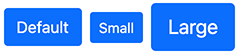

# Button

> This is a multifunction component that will allow several actions, by creating a button with multiple styles, sizes, and more.

The list of action are:

-   An internal link or a URL
-   A collapsible content
-   A modal (dialog prompts)
-   A popover

## Button properties

When creating a new button you can fill this two properties

| Label | Name | Description |
| --- | --- | --- | 
| **Title**  | `jcr:title` |  the title will be used as the clickable label | 
| **Action** | `buttonType` | this will provide a choice list of actions (see list below) |

A few advanced settings are only available when clicking on the Advanced settings `bootstrap5mix:buttonAdvancedSettings` mixin

| Label | Name | Description | Default value |
| --- | --- | --- | --- |
| **Style** | `style` | Pick a predefined styles: Primary, Secondary, Success, Danger,  Warning, Info, Light, Dark, No style (link only), or Custom <br/>  <br/>If the style is set to Custom, then only the CSS classes set on the Custom Class(es) to set on this button (cssClass) will be used on the button. | Primary |
| **Size** | `size` | Pick a size. It could be Default, Small or Large. <br/>  | Default| 
| **Outline** | `outline` |  In need of a button, but not the hefty background colors they bring <br/>  | false | 
| **Full width button** | `block` | Create responsive stacks of full-width, “block buttons”<br/>  | false | 
| **State** | `state` | Make buttons look active or disabled <br/>  | Default | 
| **Custom Class(es) to set on this button** | `cssClass` | This allows you to add any CSS classes on the button. | | 
| **Disable text wrapping** | `disableTextWrapping` | If you don’t want the button text to wrap | false | 
| **Stretched link** | `stretchedLink` | Make any HTML element or Bootstrap component clickable by “stretching” a nested link via CSS. As a result the link to make its containing block clickable. This for fine on components such a card or any component with a position relative (or with the class position-relative). Multiple links and tap targets are not recommended | false |

## Button definition

Here are the button and the advanced settings definitions

```cnd
[bootstrap5nt:button]> jnt:content, bootstrap5mix:component, mix:title
- buttonType (string, choicelist[buttonTypeInitializer, resourceBundle]) = 'internalLink' autocreated indexed=no < 'internalLink', 'externalLink', 'modal', 'collapse','popover'

[bootstrap5mix:buttonAdvancedSettings] mixin
extends = bootstrap5nt:button
itemtype = content
- style (string, choicelist[resourceBundle]) = 'primary' autocreated indexed=no < 'primary', 'secondary', 'success', 'info', 'warning', 'danger', 'link','dark','light','custom'
- size (string, choicelist[resourceBundle]) = 'default' autocreated indexed=no < 'default', 'btn-lg', 'btn-sm'
- outline (boolean) = 'false' indexed=no
- block (boolean) = 'false' indexed=no
- state (string, choicelist[resourceBundle]) = 'default' autocreated indexed=no < 'default', 'active', 'disabled'
- cssClass (string) indexed=no
- disableTextWrapping (boolean) = 'false' indexed=no
- stretchedLink (boolean) = 'false' indexed=no
```

Depending on the chosen action (buttonType), an initializer will add a mixin on the fly to the node. The mixin can be one of these (see full description below):

- `bootstrap5mix:internalLink` for Internal link
- `bootstrap5mix:externalLink` for URL
- `bootstrap5mix:collapse` for Collapse
- `bootstrap5mix:modal` for Modal
- `bootstrap5mix:popover` for Popover


## Internal link

Choose the action internal link to create a link to local content. This will add the mixin `bootstrap5mix:internalLink` to the button node.

### Internal link Properties
| Label | Name | Description | Default value |
| --- | --- | --- | --- |
| **link** | `internalLink` | This can be any editorial content, or a page, or a file. | | 

### Internal link definition

Here is the definition of the mixin `bootstrap5mix:internalLink`

```cnd
[bootstrap5mix:internalLink] > jmix:templateMixin mixin
extends = bootstrap5nt:button
- internalLink (weakreference, picker[type='editoriallink']) < jmix:droppableContent, jnt:page, jnt:file
```

## URL

Choose the action URL to create a link to any URL. This will add the mixin `bootstrap5mix:externalLink` to the button node.

### URL Properties

| Label | Name | Description | Default value |
| --- | --- | --- | --- |
| URL | `externalLink`|  This can be any URL | https:// | 

### URL definition

Here is the definition of the mixin `bootstrap5mix:externalLink`

```cnd
[bootstrap5mix:externalLink] > jmix:templateMixin mixin
extends = bootstrap5nt:button
- externalLink (string) = 'http://'
```

## Collapse

Choose the action Collapse to toggle the visibility of content. The buttons will be used as triggers that are mapped to specific elements you toggle. This will add the mixin `bootstrap5mix:collapse` to the button node. This action is similar to the accordion component

### Collapse properties

| Label | Name | Description | Default value |
| --- | --- | --- | --- |
|Show content |`show`| if checked, the content of the collapse will be expanded as default (default is none)| false |

### Collapse definition

Here is the definition of the mixin `bootstrap5mix:collapse`

```cnd
[bootstrap5mix:collapse] > jmix:templateMixin, jmix:browsableInEditorialPicker mixin orderable
extends = bootstrap5nt:button
- show (boolean) = 'false' indexed=no
+ * (jmix:droppableContent) = jmix:droppableContent
```

This node will allow you to add any content on the expanded part (the collapsed body).

## Modal (dialog prompts)

Choose the action modal to prompt for a dialog. This will add the mixin `bootstrap5mix:modal` to the button node.


### Modal properties

| Label | Name | Description | Default value |
| --- | --- | --- | --- |
| **Title for the modal  header** |`modalTitle`| Optional title for the modal header | |
|  **Label for the close button** |`closeText`| Label used for the close button | Close |
|  **Size of the modal** |`modalSize`|  value can be the default one, Large, Small or Extra Large | Default |
|  **Static backdrop (the modal will not close when clicking outside it)** |`staticBackdrop`| When set, the modal | false | will not close when clicking outside it. Click the button below to try it.
|  **Vertically centered** |`verticallyCentered`| When set, vertically center the modal | false |

### Modal definition

Here is the definition of the mixin `bootstrap5mix:modal`

```cnd
[bootstrap5mix:modal] > jmix:templateMixin, jmix:browsableInEditorialPicker mixin orderable
extends = bootstrap5nt:button
- modalTitle (string) i18n
- closeText (string) = 'Close' i18n
- modalSize (string, choicelist[resourceBundle]) = 'default' autocreated indexed=no < 'default', 'lg', 'sm', 'xl'
- staticBackdrop (boolean) = 'false' indexed=no
- verticallyCentered (boolean) = 'false' indexed=no
+ * (jmix:droppableContent) = jmix:droppableContent
```

This node will allow you to add any content to the modal body.

## Popover

Choose the action Popover display a popover. This will add the mixin `bootstrap5mix:popover` to the button node.


### Popover properties

| Label | Name | Description | Default value |
| --- | --- | --- | --- |
|**Title of the popover** |`popoverTitle`| If not set, the title is ignored || 
|**Content** |`popoverContent`|Content pf the popover. This can be rich text or text with HTML tags|| 
|**Direction** |`direction`| Four options are available: top, right, bottom, and left-aligned. Directions are mirrored when using Bootstrap in RTL.|top| 
|**Insert HTML into the popover** |`html`| If not set, innerText property will be used to insert content into the DOM. Use text if you're worried about XSS attacks.|true|

### Popover definition

Here is the definition of the mixin `bootstrap5mix:popover`

```cnd
[bootstrap5mix:popover] > jmix:templateMixin mixin
extends = bootstrap5nt:button
- popoverTitle (string) i18n
- popoverContent (string) i18n
- direction (string, choicelist[resourceBundle]) = 'top' autocreated indexed=no < 'top', 'left', 'right', 'bottom'
- html (boolean) = 'false' indexed=no
```
