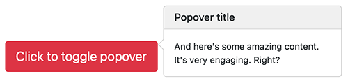

# Button Component Documentation

The Button component is a multifunction component that allows for various actions by creating a button with multiple styles, sizes, and more.

The supported actions for the button are:

- Internal link or URL
- Collapsible content
- Modal (dialog prompts)
- Popover
- Offcanvas

## Button Properties

When creating a new button, you can fill in the following two properties:

| Label         | Name         | Description                                |
| ------------- | ------------ | ------------------------------------------ |
| **Title**     | `jcr:title`  | The title used as the clickable label.      |
| **Action**    | `buttonType` | Provides a choice list of actions.          |

Advanced settings are available when clicking on the "Advanced settings" mixin (`bootstrap5mix:buttonAdvancedSettings`).

| Label                                 | Name                  | Description                                                                                                                                 | Default value |
| ------------------------------------- | --------------------- | ------------------------------------------------------------------------------------------------------------------------------------------- | ------------- |
| **Style**                             | `style`               | Pick a predefined style: Primary, Secondary, Success, Danger, Warning, Info, Light, Dark, No style (link only), or Custom.                    | Primary       |
| **Size**                              | `size`                | Pick a size: Default, Small, or Large.                                                                                                       | Default       |
| **Outline**                           | `outline`             | Use a button without background colors.                                                                                                      | False         |
| **Full width button**                 | `block`               | Create responsive stacks of full-width "block buttons".                                                                                      | False         |
| **State**                             | `state`               | Make buttons look active or disabled.                                                                                                       | Default       |
| **Custom Class(es) to set on this button** | `cssClass`        | Add custom CSS classes to the button.                                                                                                       |               |
| **Disable text wrapping**             | `disableTextWrapping` | Prevent button text from wrapping.                                                                                                          | False         |
| **Stretched link**                    | `stretchedLink`       | Make any HTML element or Bootstrap component clickable by "stretching" a nested link via CSS.                                              | False         |

## Button Definition

Below are the definitions for the Button and Advanced Settings:

```cnd
[bootstrap5nt:button] > jnt:content, bootstrap5mix:component, mix:title
- buttonType (string, choicelist[buttonTypeInitializer, resourceBundle]) = 'internalLink' autocreated indexed=no < 'internalLink', 'externalLink', 'modal', 'collapse', 'popover'

[bootstrap5mix:buttonAdvancedSettings] mixin
extends = bootstrap5nt:button
itemtype = content
- style (string, choicelist[resourceBundle]) = 'primary' autocreated indexed=no < 'primary', 'secondary', 'success', 'info', 'warning', 'danger', 'link', 'dark', 'light', 'custom'
- size (string, choicelist[resourceBundle]) = 'default' autocreated indexed=no < 'default', 'btn-lg', 'btn-sm'
- outline (boolean) = 'false' indexed=no
- block (boolean) = 'false' indexed=no
- state (string, choicelist[resourceBundle]) = 'default' autocreated indexed=no < 'default', 'active', 'disabled'
- cssClass (string) indexed=no
- disableTextWrapping (boolean) = 'false' indexed=no
- stretchedLink (boolean) = 'false' indexed=no
```

Depending on the chosen action (`buttonType`), an initializer will add a mixin to the node dynamically. The available mixins for different actions are as follows:

- `bootstrap5mix:internalLink` for Internal Link
- `bootstrap5mix:externalLink` for External Link (URL)
- `bootstrap5mix:collapse` for Collapse
- `bootstrap5mix:modal` for Modal
- `bootstrap5mix:popover` for Popover
- `bootstrap5mix:Offcanvas` for Offcanvas

---

## Internal Link

Selecting the "internalLink" action allows you to create a link to local content. This action adds the `bootstrap5mix:internalLink` mixin to the button node.

### Internal Link Properties

| Label    | Name           | Description                                        | Default value |
| -------- | -------------- | -------------------------------------------------- | ------------- |
| **Link** | `internalLink` | This can be any editorial content, page, or file.   |               |

### Internal Link Definition

The following is the definition of the `bootstrap5mix:internalLink` mixin:

```cnd
[bootstrap5mix:internalLink] > jmix:templateMixin mixin
extends = bootstrap5nt:button
- internalLink (weakreference, picker[type='editoriallink']) < jmix:droppableContent, jnt:page, jnt:file
```

The `bootstrap5mix:internalLink` mixin inherits from `bootstrap5nt:button` and adds the `internalLink` property, which allows for a reference to be set to any editorial content, page, or file.

## URL

Selecting the "URL" action allows you to create a link to any URL. This action adds the `bootstrap5mix:externalLink` mixin to the button node.

### URL Properties

| Label | Name           | Description     | Default value |
| ----- | -------------- | --------------- | ------------- |
| URL   | `externalLink` | The target URL   | https://       |

### URL Definition

Here is the definition of the `bootstrap5mix:externalLink` mixin:

```cnd
[bootstrap5mix:externalLink] > jmix:templateMixin mixin
extends = bootstrap5nt:button
- externalLink (string) = 'http://'
```

The `bootstrap5mix:externalLink` mixin extends `bootstrap5nt:button` and introduces the `externalLink` property, allowing you to specify any URL as the target for the button's link.

## Collapse

Selecting the "Collapse" action enables you to toggle the visibility of content. The buttons act as triggers that control specific elements to be toggled. This action adds the `bootstrap5mix:collapse` mixin to the button node. It is similar to the functionality provided by the accordion component.

### Collapse Properties

| Label         | Name   | Description                                            | Default value |
| ------------- | ------ | ------------------------------------------------------ | ------------- |
| Show content  | `show` | If checked, the content of the collapse will be expanded | false         |

### Collapse Definition

Here is the definition of the `bootstrap5mix:collapse` mixin:

```cnd
[bootstrap5mix:collapse] > jmix:templateMixin, jmix:browsableInEditorialPicker mixin orderable
extends = bootstrap5nt:button
- show (boolean) = 'false' indexed=no
+ * (jmix:droppableContent) = jmix:droppableContent
```

The `bootstrap5mix:collapse` mixin is a template mixin that extends `bootstrap5nt:button`. It introduces the `show` property, which determines whether the content of the collapse should be expanded by default. Additionally, the mixin allows you to add any content to the expanded part (the collapsed body) of the collapse component.

## Modal (Dialog Prompts)

Selecting the "Modal" action prompts a dialog. This action adds the `bootstrap5mix:modal` mixin to the button node.


### Modal Properties

| Label                                | Name                  | Description                                                            | Default value |
| ------------------------------------ | --------------------- | ---------------------------------------------------------------------- | ------------- |
| **Title for the modal header**       | `modalTitle`          | Optional title for the modal header                                     |               |
| **Label for the close button**       | `closeText`           | Label used for the close button                                         | Close         |
| **Size of the modal**                | `modalSize`           | The size of the modal: default, large, small, or extra large            | Default       |
| **Static backdrop**                  | `staticBackdrop`      | When enabled, the modal will not close when clicking outside of it      | false         |
| **Vertically centered**              | `verticallyCentered`  | When enabled, vertically center the modal                               | false         |

### Modal Definition

Here is the definition of the `bootstrap5mix:modal` mixin:

```cnd
[bootstrap5mix:modal] > jmix:templateMixin, jmix:browsableInEditorialPicker mixin orderable
extends = bootstrap5nt:button
- modalTitle (string) i18n
- closeText (string) = 'Close' i18n
- modalSize (string, choicelist[resourceBundle]) = 'default' autocreated indexed=no < 'default', 'lg', 'sm', 'xl'
- staticBackdrop (boolean) = 'false' indexed=no
- verticallyCentered (boolean) = 'false' indexed=no
+ * (jmix:droppableContent) = jmix:droppableContent
```

The `bootstrap5mix:modal` mixin is a template mixin that extends `bootstrap5nt:button`. It introduces properties such as `modalTitle` for specifying an optional title for the modal header, `closeText` for setting the label of the close button, `modalSize` for selecting the size of the modal, `staticBackdrop` to control whether the modal closes when clicking outside of it, and `verticallyCentered` to vertically center the modal. Additionally, the mixin allows you to add any content to the modal body using the `jmix:droppableContent` property.

## Popover

Selecting the "Popover" action displays a popover. This action adds the `bootstrap5mix:popover` mixin to the button node.



### Popover Properties

| Label                            | Name              | Description                                                                                      | Default value |
| -------------------------------- | ----------------- | ------------------------------------------------------------------------------------------------ | ------------- |
| **Title of the popover**         | `popoverTitle`    | The title of the popover. If not set, the title is ignored.                                       |               |
| **Content**                      | `popoverContent`  | The content of the popover. This can be rich text or text with HTML tags.                        |               |
| **Direction**                    | `direction`       | The direction in which the popover should be displayed: top, right, bottom, or left-aligned.     | top           |
| **Insert HTML into the popover** | `html`            | When enabled, allows inserting HTML content into the popover. Use text if concerned about XSS.   | true          |

### Popover Definition

Here is the definition of the `bootstrap5mix:popover` mixin:

```cnd
[bootstrap5mix:popover] > jmix:templateMixin mixin
extends = bootstrap5nt:button
- popoverTitle (string) i18n
- popoverContent (string) i18n
- direction (string, choicelist[resourceBundle]) = 'top' autocreated indexed=no < 'top', 'left', 'right', 'bottom'
- html (boolean) = 'false' indexed=no
```

The `bootstrap5mix:popover` mixin is a template mixin that extends `bootstrap5nt:button`. It introduces properties such as `popoverTitle` for specifying the title of the popover, `popoverContent` for defining the content of the popover, `direction` for selecting the direction of the popover (top, left, right, or bottom), and `html` for enabling the insertion of HTML content into the popover.

## Offcanvas

The Offcanvas component is a sidebar that can be toggled via JavaScript to appear from the left, right, or bottom edge of the viewport. This action adds the `bootstrap5mix:Offcanvas` mixin to the button node.


### Offcanvas Properties

| Label                                       | Name                 | Description                                              | Default value |
| ------------------------------------------- | -------------------- | -------------------------------------------------------- | ------------- |
| **Title of the Offcanvas**                   | `OffcanvasTitle`     | The title of the Offcanvas. If not set, the title is ignored. |               |
| **Placement**                               | `placement`          | The placement of the Offcanvas: start, end, or bottom.    | start         |
| **Apply a backdrop on body**                 | `enableBackdrop`     | When checked, a backdrop is applied to the body.         | true          |
| **Allow body scrolling while Offcanvas is open** | `enableBodyScrolling` | When checked, the body can be scrolled while the Offcanvas is open. | false         |

### Offcanvas Definition

Here is the definition of the `bootstrap5mix:Offcanvas` mixin:

```cnd
[bootstrap5mix:Offcanvas] > jmix:templateMixin, jmix:browsableInEditorialPicker mixin orderable
extends = bootstrap5nt:button
- OffcanvasTitle (string) i18n
- placement (string, choicelist[resourceBundle]) = 'start' autocreated indexed=no < 'start', 'end', 'bottom'
- enableBackdrop (boolean) = 'true' indexed=no
- enableBodyScrolling (boolean) = 'false' indexed=no
+ * (jmix:droppableContent) = jmix:droppableContent
```

The `bootstrap5mix:Offcanvas` mixin is a template mixin that extends `bootstrap5nt:button`. It introduces properties such as `OffcanvasTitle` for specifying the title of the Offcanvas, `placement` for selecting the placement of the Offcanvas (start, end, or bottom), `enableBackdrop` for enabling a backdrop on the body, and `enableBodyScrolling` for allowing body scrolling while the Offcanvas is open.

[Back to README](../README.md)