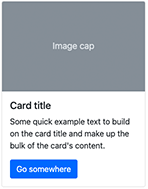

# Card

The Card component in Bootstrap provides a flexible and extensible content container with multiple variants and options. It allows you to display headers, footers, various types of content, contextual background colors, and offers powerful display options.



## Card Properties

| Label                           | Name                     | Description                                                                                                      | Default value |
| ------------------------------- | ------------------------ | ---------------------------------------------------------------------------------------------------------------- | ------------- |
| **Title**                       | `jct:title`              | The title of the card, displayed in the card header.                                                              |               |
| **Image**                       | `bootstrap5mix:image`    | An optional image that can be added to the card.                                                                  |               |
| **Heading for the title**       | `headerSize`             | Allows you to specify the heading size for the title, ranging from H1 to H5, or no heading at all.               |               |
| **Alignment**                   | `textAlign`              | Sets the text alignment for the entire card. Options are Start (default), End, or Center.                        | start         |
| **Footer**                      | `footer`                 | Text to be displayed in the card footer.                                                                          |               |

## Card Advanced Properties

You can also customize the card further with the following advanced properties:

| Label                               | Name                    | Description                                                                   | Default value |
| ----------------------------------- | ----------------------- | ----------------------------------------------------------------------------- | ------------- |
| **Class(es) to set on this Card**   | `cssClass`              | Add custom CSS classes to the `card` element.                                  |               |
| **Class(es) to set on the Card Body** | `cardBodyCssClass`       | Add custom CSS classes to the `card-body` element.                             |               |
| **Class(es) to set on the Card Header** | `cardHeaderCssClass`    | Add custom CSS classes to the `card-header` element.                           |               |
| **Allow any content on the footer** | `freeFooter`            | Allow any content to be added to the `card-footer` element.                    | false         |

## Card Colors

You can also customize the text color, background color, and border color of the card using the following properties:

| Label         | Name          | Description                                                                                         |
| ------------- | ------------- | --------------------------------------------------------------------------------------------------- |
| **Text**      | `textColor`   | Choose a color for the text. Options include: Muted, Primary, Secondary, Success, Danger, Warning, Info, Light, Dark, White, Body, Black-50, White-50. |
| **Border**    | `borderColor` | Choose a color for the border. Options include: Default, Primary, Secondary, Success, Danger, Warning, Info, Light, Dark, White.                             |

## Card Definition

Here is the definition of the Card:

```cnd
[bootstrap5mix:colors] mixin
extends = bootstrap5nt:card
itemtype = content
- backgroundColor (string, choicelist[resourceBundle]) = 'default' autocreated indexed=no < 'default','primary','secondary','success','danger','warning','info','light','dark','white','transparent'
- textColor (string, choicelist[resourceBundle]) = 'dark' autocreated indexed=no < 'muted','primary','secondary','success','danger','warning','info','light','dark','white','body','black-50','white-50'
- borderColor (string, choicelist[resourceBundle]) = 'default' autocreated indexed=no < 'default','primary','secondary','success','danger','warning','info','light','dark','white'

[bootstrap5nt:card]> jnt:content, bootstrap5mix:component, mix:title, jmix:list, bootstrap5mix:image, jmix:browsableInEditorialPicker
- headerSize (string, choicelist[resourceBundle]) = 'default' autocreated indexed=no < 'default', 'h1', 'h2', 'h3', 'h4', 'h5'
- textAlign (string, choicelist[resourceBundle]) = 'text-start' autocreated indexed=no < 'text-start', 'text-end', 'text-center'
- footer (string) i18n
+ * (jmix:droppableContent) = jmix:droppableContent

[bootstrap5mix:cardAdvancedSettings] mixin
extends = bootstrap5nt:card
itemtype = content
- cssClass (string) = 'card' indexed=no
- cardBodyCssClass (string) = 'card-body' indexed=no
- freeFooter (boolean) = 'false' indexed=no
```

[Back to README](../README.md)