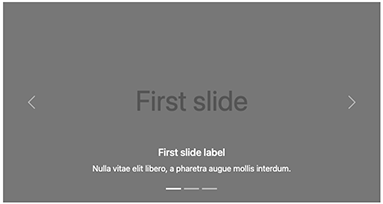
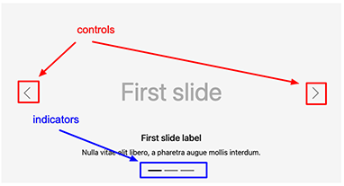

# Carousel

The Carousel component in Bootstrap allows you to create a slideshow of elements such as images or slides of text, resembling a carousel.



## Carousel Properties

You can customize the behavior and appearance of the carousel by modifying the following properties:



| Label | Name | Description | Default value |
| --- | --- | --- | --- |
| **Display controls** | `useLeftAndRightControls` | Determines whether to show previous and next controls for navigating the carousel. | true |
| **Display indicators** | `useIndicators` | Determines whether to display indicators alongside the controls to show the current slide. | false |
| **Delay between automatically cycling (ms)** | `interval` | Sets the amount of time to wait before automatically transitioning to the next slide. Note that this is a global setting and can be overridden per slide. | 5000ms |
| **React to keyboard events** | `keyboard` | Specifies whether the carousel should respond to keyboard events. | true |
| **Pause on hover** | `pause` | Determines if the carousel should pause cycling when the mouse hovers over it and resume when the mouse leaves. If unset, hovering over the carousel won't pause it. | true |
| **Autoplay** | `ride` | Starts the carousel animation automatically when the page loads. | true |
| **Continuous cycling** | `wrap` | Specifies whether the carousel should cycle continuously or have hard stops. | true |
| **Crossfade transition** | `fade` | Controls whether the slides should transition with a fade effect instead of a slide animation. | true |
| **Custom CSS Class for the carousel** | `carouselClass` | Allows you to set a custom CSS class for the carousel element. | |
| **Variant** | `variant` | Allows you to choose a darker variant for the controls, indicators, and captions instead of the default one. | white |

## Carousel Definition

Here is the definition of a carousel:

```cnd
[bootstrap5mix:carouselAdvancedSettings] mixin
extends = bootstrap5nt:carousel
itemtype = content
- useIndicators (boolean) = 'false' indexed=no
- useLeftAndRightControls (boolean) = 'true' indexed=no
- interval (long) = '5000' indexed=no
- keyboard (boolean) = 'true' indexed=no
- pause (boolean) = 'true' indexed=no
- ride (boolean) = 'true' indexed=no
- wrap (boolean) = 'true' indexed=no
- fade (boolean) = 'true' indexed=no
- carouselClass (string) indexed=no
- variant (string, choicelist[resourceBundle]) = 'white' autocreated indexed=no   < 'white', 'dark'

[bootstrap5nt:carousel] > jnt:content, bootstrap5mix:component, jmix:list, jmix:siteContent, jmix:browsableInEditorialPicker orderable
+ * (bootstrap5nt:carouselItem)
```

This component will create a list of slides of type `bootstrap5nt:carouselItem`.

## Properties of a Slide
Each slide of the carousel, represented by `bootstrap5nt:carouselItem`, can be customized with the following properties:

| Label | Name | Description |
| --- | --- | --- |
| **Title** | `jcr:title` | The title of the slide. |
| **Image** | `image` | The image displayed in the slide. |
| **Caption** | `caption` | The text caption for the slide. |

You can also enable advanced properties to further customize each slide:

| Label | Name | Description | Default value |
| --- | --- | --- | --- |
| **Title color** | `titleColor` | Allows you to set the color of the slide's title. Choose from options such as Muted, Primary, Secondary, Success, Danger, Warning, Info, Light, Dark, White, Body, Black-50, White-50. | |
| **Caption color** | `captionColor` | Allows you to set the color of the slide's caption. Choose from options such as Muted, Primary, Secondary, Success, Danger, Warning, Info, Light, Dark, White, Body, Black-50, White-50. | |
| **Custom CSS Class for the slide** | `carouselItemClass` | Allows you to apply a custom CSS class to the `carousel-item` element representing the slide. | |
| **Individual slide interval (ms)** | `interval` | Sets a specific delay between slides, overriding the global interval value. | 5000ms |

## Definition of a Slide

```cnd
[bootstrap5mix:advancedCarouselItem] mixin
extends = bootstrap5nt:carouselItem
itemtype = content
- titleColor (string, choicelist[resourceBundle]) = 'light' autocreated indexed=no < 'muted','primary','secondary','success','danger','warning','info','light','dark','white','body','black-50','white-50'
- captionColor (string, choicelist[resourceBundle]) = 'light' autocreated indexed=no < 'muted','primary','secondary','success','danger','warning','info','light','dark','white','body','black-50','white-50'
- carouselItemClass (string) indexed=no
- interval (long) indexed=no

[bootstrap5nt:carouselItem] > jnt:content, mix:title
- image (weakreference, picker[type='image']) mandatory < 'jmix:image'
- caption (string, textarea) i18n
```

[Back to README](../README.md)