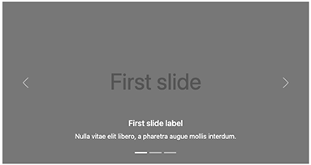
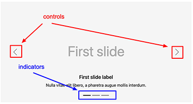

# Carousel

A slideshow that cycles through images or content — with optional controls, indicators, and captions.



---

## Setting up a carousel

1. Add a **Carousel** component (`bootstrap5nt:carousel`) to your page.
2. Add **Carousel Item** children inside it — each one is a slide.
3. Each slide requires an image and can have an optional title and caption.

---

## Carousel properties

These control the overall carousel behaviour. Enable the `bootstrap5mix:carouselAdvancedSettings` mixin to expose them.



| Property | Name | Description | Default |
|---|---|---|---|
| **Show controls** | `useLeftAndRightControls` | Previous/Next arrows on the sides. | true |
| **Show indicators** | `useIndicators` | Dot indicators at the bottom showing the current slide. | false |
| **Auto-advance interval** | `interval` | Milliseconds between slides. | 5000 |
| **Respond to keyboard** | `keyboard` | Arrow keys navigate slides. | true |
| **Pause on hover** | `pause` | Stops cycling while the mouse is over the carousel. | true |
| **Autoplay** | `ride` | Starts cycling automatically on page load. | true |
| **Loop** | `wrap` | Cycles continuously (last slide → first slide). | true |
| **Crossfade transition** | `fade` | Fades between slides instead of sliding. | true |
| **Custom CSS class** | `carouselClass` | Extra CSS class on the carousel element. | — |
| **Variant** | `variant` | Use `dark` for dark controls/captions on light backgrounds. | white |

```cnd
[bootstrap5mix:carouselAdvancedSettings] mixin
  extends = bootstrap5nt:carousel
  itemtype = content
  - useIndicators          (boolean) = 'false' indexed=no
  - useLeftAndRightControls (boolean) = 'true' indexed=no
  - interval               (long)    = '5000'  indexed=no
  - keyboard               (boolean) = 'true'  indexed=no
  - pause                  (boolean) = 'true'  indexed=no
  - ride                   (boolean) = 'true'  indexed=no
  - wrap                   (boolean) = 'true'  indexed=no
  - fade                   (boolean) = 'true'  indexed=no
  - carouselClass          (string)             indexed=no
  - variant (string, choicelist[resourceBundle]) = 'white' autocreated indexed=no
    < 'white', 'dark'

[bootstrap5nt:carousel] > jnt:content, bootstrap5mix:component,
    jmix:list, jmix:siteContent, jmix:browsableInEditorialPicker orderable
  + * (bootstrap5nt:carouselItem)
```

---

## Slide properties (`bootstrap5nt:carouselItem`)

| Property | Name | Description |
|---|---|---|
| **Title** | `jcr:title` | Slide title, displayed as an overlay. |
| **Image** | `image` | The slide image *(required)*. |
| **Caption** | `caption` | Text displayed below the title. |

Enable the `bootstrap5mix:advancedCarouselItem` mixin for per-slide customisation:

| Property | Name | Description | Default |
|---|---|---|---|
| **Title colour** | `titleColor` | Bootstrap text colour for the title. | light |
| **Caption colour** | `captionColor` | Bootstrap text colour for the caption. | light |
| **Slide CSS class** | `carouselItemClass` | Extra CSS class on this slide's `carousel-item`. | — |
| **Individual interval** | `interval` | Override the global interval for this slide only. | — |

```cnd
[bootstrap5nt:carouselItem] > jnt:content, mix:title
  - image   (weakreference, picker[type='image']) mandatory < 'jmix:image'
  - caption (string, textarea) i18n

[bootstrap5mix:advancedCarouselItem] mixin
  extends = bootstrap5nt:carouselItem
  itemtype = content
  - titleColor       (string, choicelist[resourceBundle]) = 'light' autocreated indexed=no
  - captionColor     (string, choicelist[resourceBundle]) = 'light' autocreated indexed=no
  - carouselItemClass (string) indexed=no
  - interval         (long)   indexed=no
```

---

[← Back to README](../README.md)
