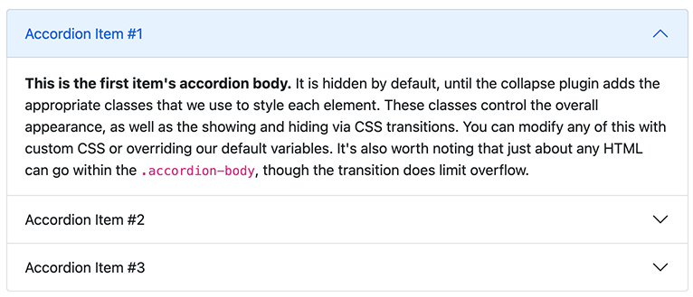
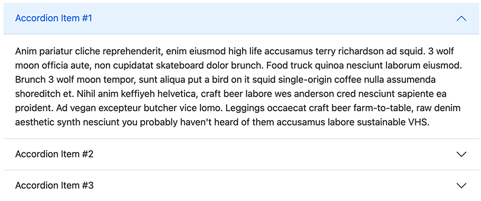

# Accordion

An accordion displays a list of collapsible panels. Only one panel (or several) can be open at a time.

## How to use

1. Add an **Accordion** component to your page area
2. Inside it, add one or more **Accordion Item** components
3. Each item has a title (the clickable header) and a body (the collapsible content)

## Accordion properties

| Field | Description |
|-------|-------------|
| Flush | Remove the outer border and rounded corners, blending the accordion with its surrounding container |

## Accordion Item properties

| Field | Description |
|-------|-------------|
| Title | The clickable header label |
| Text | Rich-text body content |
| Show | Start this panel in the expanded (open) state |

The body area also accepts any droppable content component — you are not limited to the rich-text field.
