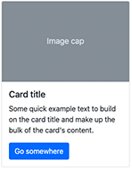

# Card

A card is a flexible content container with an optional image, header, body, and footer.

## Properties

| Field | Description |
|-------|-------------|
| Title | Card header text |
| Header level | HTML heading level for the title (h1–h5) or plain `div` |
| Image | Pick an image from the media library (displays above the body) |
| Text alignment | left, center, right |
| Footer text | Static footer text (i18n key — for plain text footers) |

## Colors (Advanced settings — Colors tab)

| Field | Description |
|-------|-------------|
| Background color | Card background |
| Text color | Card text |
| Border color | Card border |

## Advanced settings

| Field | Description |
|-------|-------------|
| CSS class | Additional classes on the outer `
` |
| Header CSS class | Additional classes on the header element |
| Body CSS class | Additional classes on `
` |
| Free footer | Replace the static footer text with a droppable area |

## Body

The card body accepts any droppable content component.

## Notes

- If no image is selected, no `` is rendered.
- Enabling **Free footer** removes the static footer text and adds a droppable area in its place.
