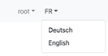
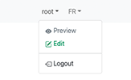
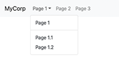

# Navbar

The Navbar renders the site navigation header, including the brand logo/name, the page menu tree, an optional login button, and an optional language switcher.

## Properties

### Navigation root

| Field | Description |
|-------|-------------|
| Root page | `Home page`, `Current page`, `Parent of current page`, or `Custom root page` |
| Custom root page | (shown when root = Custom) Picker to select the root page |
| Max levels | Number of menu levels to display (1–5) |

### Brand

| Field | Description |
|-------|-------------|
| Brand text | The site name displayed next to the logo |
| Brand image | Logo image (desktop) |
| Brand image (mobile) | Logo image for small screens |

> **Note:** Brand settings can also be configured at the **site level** (via the site properties in the administration). Site-level brand overrides the component-level setting.

### Options

| Field | Description |
|-------|-------------|
| Add login button | Display a login/logout button in the navbar |
| Add language button | Display a language switcher dropdown |
| Add container inside navbar | Wrap the navbar content in a `.container` div |

### Appearance (Advanced)

| Field | Description |
|-------|-------------|
| Nav CSS class | Classes on the `<nav>` element |
| Div CSS class | Classes on the inner div |
| Toggler CSS class | Classes on the mobile hamburger button |
| Brand link CSS class | Classes on the brand `<a>` |
| Brand image CSS class | Classes on the brand `` |
| UL CSS class | Classes on the `<ul class="navbar-nav">` |
| LI CSS class | Classes on each `<li>` nav item |
| Nav link CSS class | Classes on each `<a class="nav-link">` |
| Login menu UL CSS class | Classes on the login dropdown `<ul>` |

## Notes

- The menu tree is built automatically from the page hierarchy starting at the selected root.
- Only pages with **Display in menu** enabled appear in the navbar.
- The active page and its ancestors receive the `active` CSS class.
- On mobile, the menu collapses and is revealed by a hamburger button.

