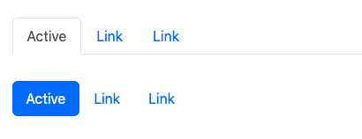
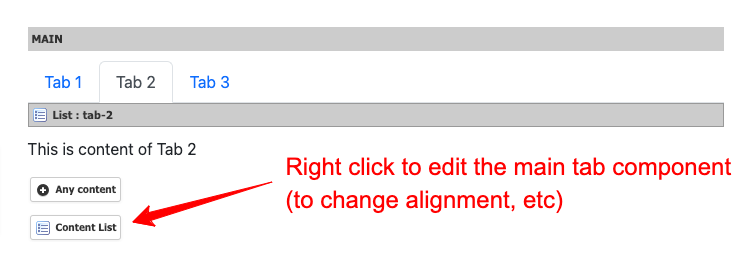
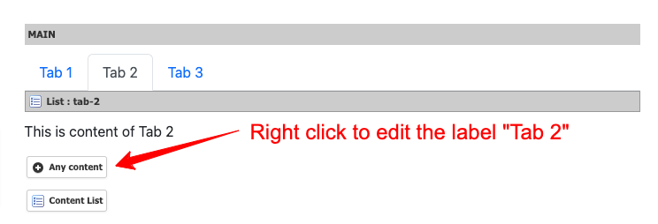
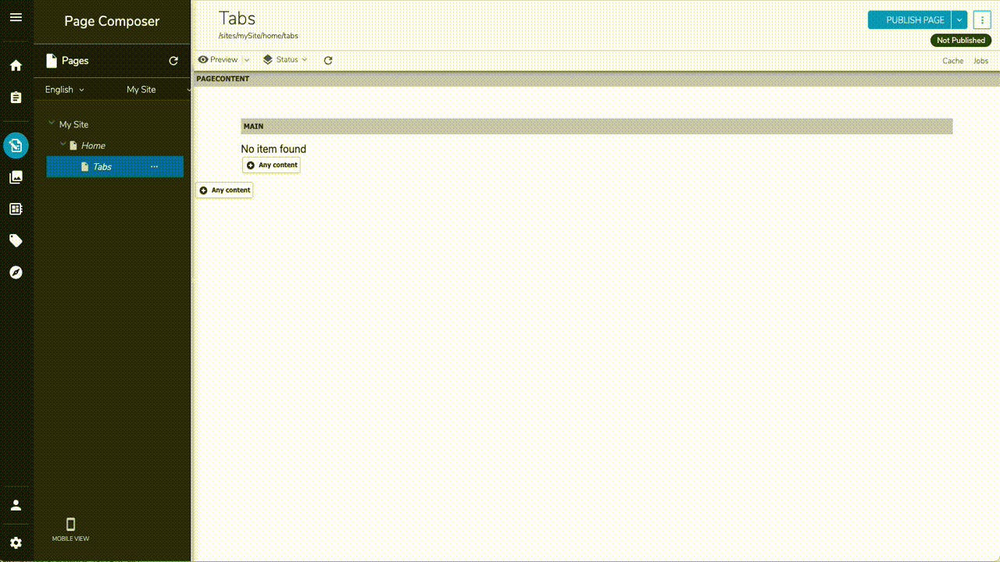

# Tabs

The Tabs component displays content in labelled panels. Only one panel is visible at a time; clicking a tab label reveals its panel.

## How to use

1. Add a **Tabs** component
2. Inside it, add **Content Lists** — one per tab panel
3. Name each Content List: the name becomes the tab label (and the URL anchor)
4. Add content components inside each Content List

## Properties

| Field | Description |
|-------|-------------|
| Type | `tab` (underline bar), `pill` (rounded pill), `link` (no indicator), `underline` |
| Fade | Animate the panel transition with a fade |
| Alignment | `justify-content-start`, `justify-content-center`, `justify-content-end`, `nav-fill`, `nav-justified` |
| Use list name as anchor | Use the Content List name as the URL hash anchor (enables deep-linking) |

## Notes

- Deep-linking is built in: if the page URL contains a hash matching a tab anchor (e.g. `#my-tab`), that tab opens automatically on load.
- Navigating to a different tab updates the URL hash, allowing the browser Back button to work.
- Tab anchor names are sanitized automatically: spaces and special characters become hyphens.

