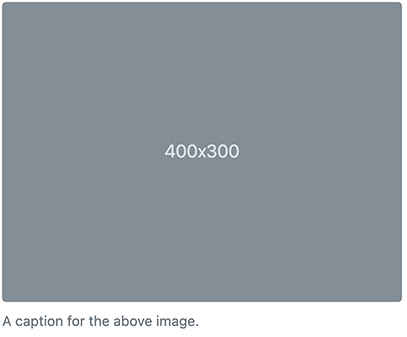

# Figure

The Figure component in Bootstrap allows you to display content, such as an image with an optional caption, in a visually appealing way.



Here is the related HTML

````html
<figure class="figure">
  
  <figcaption class="figure-caption">A caption for the above image.</figcaption>
</figure>
````

## Figure Properties

A figure consists of an image and an optional caption. You can customize the figure by modifying the following properties:

| Label | Name | Description |
| --- | --- | --- |
| **Caption** | `jcr:title` | An optional caption that will be displayed after the image. |
| **Image** | `image` | The image to be displayed. |
| **Caption alignment** | `captionAlignment` | This advanced property allows you to change the alignment of the caption. Choose from options such as Start (default), Center, or End. |

## Figure Definition

Here is the definition of a figure:

```cnd
[bootstrap5mix:figureAdvancedSettings] mixin
 extends = bootstrap5nt:figure
 itemtype = content
 - captionAlignment (string, choicelist[resourceBundle]) = 'text-start' autocreated indexed=no < 'text-start', 'text-center', 'text-end'

[bootstrap5nt:figure] > jnt:content, bootstrap5mix:component, bootstrap5mix:imageAdvanced, mix:title
```

## Image Advanced Properties

There are several advanced settings available for the image within the figure:

| Label | Name | Description | Default Value |
| --- | --- | --- | --- |
| **Class(es) to set on this image** | `imageClass` | Allows you to set a custom CSS class for the `` tag. | |
| **Style(s) to set on this image** | `imageStyle` | Allows you to add custom inline styles to the image using the `style` attribute. For example, setting `"width:100px"` will add `style="width:100px"` to the `` tag. | |
| **ID to set on this image** | `imageID` | Allows you to add an `id` attribute to the `` tag with the specified value. | |
| **Responsive image** | `responsive` | When checked (default), adds the `img-fluid` class to the image. This ensures that the image scales with its parent element by applying `max-width: 100%;` and `height: auto;`. | true |
| **Alignment** | `align` | Allows you to choose the alignment of the image within the figure. Options include Start (default), Center, or End. | Default |
| **Alternate text** | `alt` | Specifies the alternate text for the image. If not set, a default alternate text with the image's name will be used. | |
| **Border-radius** | `borderRadius` | Adds classes to easily round the corners of the image. Available variants include Rounded, Only on top, Only on end, Only on bottom, Only on start, Circle, Pill, and No radius. | No radius |
| **Border-radius size** | `borderRadiusSize` | Allows you to use scaling classes for larger or smaller rounded corners. Available variants include Small, Medium, and Large. | No radius |
| **Thumbnails** | `thumbnails` | In addition to border-radius, you can use `img-thumbnail` to give the image a rounded 1px border appearance. | false |

## Image Definition

Here is the definition of the image:

```cnd
[bootstrap5mix:imageAdvancedSettings] mixin
 extends = bootstrap5mix:imageAdvanced
 itemtype = content
 - imageClass (string) indexed=no
 - imageStyle (string) indexed=no
 - imageID (string) indexed=no
 - responsive (boolean) = 'true' indexed=no
 - thumbnails (boolean) = 'false' indexed=no
 - align (string, choicelist[resourceBundle]) = 'default' autocreated indexed=no < 'default', 'start', 'end', 'center'
 - alt (string) i18n
 - borderRadius (string, choicelist[resourceBundle]) = 'rounded-0' autocreated indexed=no < 'rounded', 'rounded-top', 'rounded-end', 'rounded-bottom', 'rounded-start', 'rounded-circle', 'rounded-pill', 'rounded-0'
 - borderRadiusSize (string, choicelist[resourceBundle]) = 'default' < 'default', 'rounded-0', 'rounded-1', 'rounded-2', 'rounded-3'

[bootstrap5mix:imageAdvanced] > bootstrap5mix:image mixin

[bootstrap5mix:image] mixin
 - image (weakreference, picker[type='image']) < 'jmix:image'
```

[Back to README](../README.md)