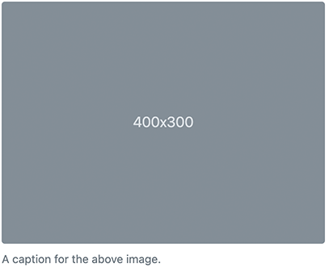

# Figure

An image with an optional caption — semantically wrapped in a Bootstrap `<figure>` element.



```html
<figure class="figure">
  
  <figcaption class="figure-caption text-center">A caption.</figcaption>
</figure>
```

---

## Properties

| Property | CND name | Description |
|---|---|---|
| **Image** | `image` | The image to display *(required)*. Picked from the media library. |
| **Caption** | `jcr:title` | Text displayed below the image in a `<figcaption>`. Leave empty to hide the caption. |
| **Caption alignment** | `captionAlignment` | `text-start` (default), `text-center`, or `text-end`. Available via `bootstrap5mix:figureAdvancedSettings`. |

---

## How the image is rendered

The figure template delegates all image rendering to the shared **`image` view**:

```jsp
<figure class="figure">
    <template:include view="image">
        <template:param name="class" value="figure-img img-fluid"/>
    </template:include>
    …
</figure>
```

The template passes `figure-img img-fluid` as the base class. If the editor has also activated `bootstrap5mix:imageAdvancedSettings`, any extra classes, styles, or id they set are merged on top — `figure-img img-fluid` is always present.

See **[Images — the `image` view and its parameters](images.md)** for the full list of template parameters and the merge rules.

---

## Advanced settings

### Caption alignment (`bootstrap5mix:figureAdvancedSettings`)

Adds horizontal alignment to the `<figcaption>`:

| Value | Bootstrap class | Result |
|---|---|---|
| `text-start` | `figure-caption text-start` | Left-aligned (default) |
| `text-center` | `figure-caption text-center` | Centred |
| `text-end` | `figure-caption text-end` | Right-aligned |

### Image presentation (`bootstrap5mix:imageAdvancedSettings`)

Gives the editor direct control over the `` element. Add extra CSS classes, an inline style, border-radius, alignment, alt text, and more — without touching the template.

Example: to display the figure image as a circle, activate `bootstrap5mix:imageAdvancedSettings` and set **Border radius** to `rounded-circle`. The view will produce:

```html

```

Full property reference → [Images](images.md#bootstrap5miximageadvancedsettings-reference).

---

## Node type reference

```cnd
[bootstrap5mix:figureAdvancedSettings] mixin
  extends = bootstrap5nt:figure
  itemtype = content
  - captionAlignment (string, choicelist[resourceBundle, moduleImage='svg']) = 'text-start' autocreated indexed=no
    < 'text-start', 'text-center', 'text-end'

[bootstrap5nt:figure] > jnt:content, bootstrap5mix:component, bootstrap5mix:imageAdvanced, mix:title
```

`bootstrap5mix:imageAdvanced` inherits the image picker from `bootstrap5mix:image` and signals to the edit form that the advanced image UI should be shown when `bootstrap5mix:imageAdvancedSettings` is activated.

---

## JS Rendering

| Source file | Registers |
|---|---|
| `bootstrap5-js-rendering/src/components/Figure/default.server.tsx` | `bootstrap5nt:figure` / `"default"` |

The JSP delegates image rendering to `image.image.jsp` via `<template:include view="image">`. The JS view uses the shared `ImageTag` helper (`src/utils/image.tsx`) instead, with `callerClass="figure-img img-fluid"`.

`ImageTag` automatically applies all `bootstrap5mix:imageAdvancedSettings` options — class, style, id, responsive, thumbnail, border-radius, alignment, alt. Caption alignment comes from `bootstrap5mix:figureAdvancedSettings` (checked via `isNodeType()` before reading).

---

[← Back to README](../README.md)
