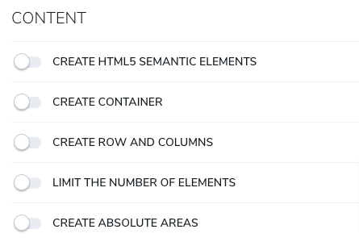
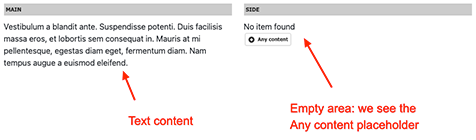

# Layout and Grid

Bootstrap's grid system is a powerful and flexible tool for creating responsive layouts in web development. It utilizes a combination of containers, rows, and columns to organize and align content effectively. The grid system is built with flexbox and is fully responsive, ensuring that your layout adapts to different screen sizes and devices.

In Bootstrap, a standard layout structure consists of HTML5 elements, containers, rows, and columns. Here's an example:

```html
<section id="copyright">
    <div class="container">
        <div class="row">
            <div class="col">
                [content here]
            </div>
            <div class="col">
                [content here]
            </div>
        </div>
    </div>
</section>
```

This complex component allows you to create various types of layouts by enabling different mixins. The visual representation of this layout in the content editor is shown below:



Let's explore the different mixins used in this component in detail.

## Create HTML5 Semantic Elements

The "Create HTML5 Semantic Elements" mixin is used to create HTML5 semantic elements. It provides the following properties:

| Label | Name | Description |
| --- | --- | --- |
| **HTML element type** | `sectionElement` | Select the HTML element to use, such as section, article, aside, hgroup, header, footer, nav, div, figure, figcaption, main. |
| **ID set on this HTML element** | `sectionId` | An optional property to create an `id` attribute on the HTML element. Example: `<section id="copyright">` |
| **Class(es) set on this HTML element** | `sectionCssClass` | An optional property to add a `class` attribute on the HTML element with a specific value. Example: `<div class="doc">` |
| **Style** | `sectionStyle` | An optional property to add a `style` attribute on the HTML element with a specific value. Example: `<div style="background-color:pink">` |
| **Aria** | `sectionAria` | An optional property to add an `aria-label` attribute on the HTML element with a specific value. Example: `<div aria-label="projects">` |

The definition of this mixin is as follows:

```cnd
[bootstrap5mix:createSection] mixin
 extends = bootstrap5nt:grid
 itemtype = content
 - sectionElement (string, choicelist[resourceBundle]) = 'div' autocreated indexed=no < 'section', 'article', 'aside', 'hgroup', 'header', 'footer', 'nav', 'div', 'figure', 'figcaption', 'main'
 - sectionId (string) indexed=no < '[a-zA-Z0-9-_]+'
 - sectionCssClass (string) indexed=no
 - sectionStyle (string) indexed=no
 - sectionRole (string) indexed=no
 - sectionAria (string) indexed=no
```

By using these mixins and understanding the grid system, you can create flexible and responsive layouts in Bootstrap.

## Create Container

This section explains how to create a Bootstrap container, which is a fundamental layout element in Bootstrap and is required when using the grid system.

The "Create Container" mixin, `bootstrap5mix:createContainer`, provides the following properties:

| Label | Name | Description |
| --- | --- | --- |
| **ID set on this container** | `containerId` | An optional property that creates an `id` attribute on the container. Example: `<div class="container" id="my-container">` |
| **Class(es) set on this container** | `containerCssClass` | An optional property that adds a `class` attribute on the container with a specific value. Example: `<div class="container custom-class">` |
| **Container width** | `containerType` | Bootstrap offers three container options: `container` (fixed width), `container-fluid` (full width), and `container-{breakpoint}` (100% wide until the specified breakpoint). |

The definition of the mixin is as follows:

```cnd
[bootstrap5mix:createContainer] mixin
 extends = bootstrap5nt:grid
 itemtype = content
 - containerId (string) < '[a-zA-Z0-9-_]+'
 - containerCssClass (string) indexed=no
 - containerType (string, choicelist[resourceBundle]) = 'container' autocreated indexed=no < 'container', 'container-fluid', 'container-sm', 'container-md', 'container-lg', 'container-xl', 'container-xxl'
```

## Create Row and Columns

This section covers the creation of a row with various options for alignment, gutters, and column types. You can choose to create a predefined grid or a custom grid, or you can create an empty row with no columns. Depending on your selection, the initializer will automatically add the mixin `bootstrap5mix:predefinedGrid` or `bootstrap5mix:customGrid` to the current node.

The "Create Row and Columns" mixin, `bootstrap5mix:createRow`, provides the following properties:

| Label | Name | Description |
| --- | --- | --- |
| **Select the type of grid** | `typeOfGrid` | Choose to create an empty row (no column), a predefined grid, or a custom grid. The corresponding mixin will be added based on your selection. |
| **ID set on this row** | `rowId` | An optional property that creates an `id` attribute on the row. Example: `<div class="row" id="my-row">` |
| **Class(es) set on this row** | `rowCssClass` | An optional property that adds a `class` attribute on the row with a specific value. Example: `<div class="row custom-class">` |
| **Vertical alignment** | `rowVerticalAlignment` | Choose the vertical alignment of the row's content: Top (default), Middle, or Bottom. |
| **Horizontal alignment** | `rowHorizontalAlignment` | Choose the horizontal alignment of the row's content: Start, Center, End, Around, Between, or Evenly. |
| **Horizontal gutter** | `horizontalGutters` | Choose a value between 0 (no gutter) and 5 (large) for the horizontal padding between columns, or use the default value. |
| **Vertical gutter** | `verticalGutters` | Choose a value between 0 (no gutter) and 5 (large) for the vertical padding between rows, or use the default value. |

### Type of grid: Empty row (no column)

This option creates a row with no columns. The area is named "main."

```html
<div class="row">
    [main area here]
</div>
```
### Type of Grid: Predefined Grid

The predefined grid offers several pre-made grid layouts that utilize the 12 template columns available per row in Bootstrap. These layouts allow you to create different combinations of elements spanning any number of columns. The predefined columns provide the following layouts:

- 12 (one single column)
- 6 / 6 (two equal columns)
- 4 / 4 / 4 (three equal columns)
- 3 / 3 / 3 / 3 (four equal columns)

Additionally, there are a few other layouts available:

- 10 / 2 and 2 / 10 (a very small and an extra large column)
- 3 / 9 and 9 / 3 (a small and a large column)
- 4 / 8 and 8 / 4 (another small and a large column)
- 3 / 6 / 3 (a large column with two small columns)

These layouts are designed for the medium breakpoint (≥768px). For example, if you choose the layout 3 / 6 / 3, the component will generate the following code:

```html
<div class="row">
    <div class="col-md-3">
        [side area here]
    </div>
    <div class="col-md-6">
        [main area here]
    </div>
    <div class="col-md-3">
        [extra area here]
    </div>
</div>
```

On the predefined grid, the names of the Jahia areas are automatically assigned. The names of the different columns are:

- `main`: the first column (larger column)
- `side`: the second column (smaller column), often used as a side column
- `extra`: the third column
- `extra2`: the last column (only used in the 3 / 3 / 3 / 3 layout)

Note that if you are using an RTL (Right-to-Left) language, the first column will be in the first position.

### Type of Grid: Custom Grid

In the custom grid, you have the flexibility to use any Bootstrap-compliant classes and separate them using commas (`,`).

For example, if you use the value `col col-md-8,col-6 col-md-4`, the component will generate the following code:

```html
<div class="row">
    <div class="col col-md-8">
        [col1 area here]
    </div>
    <div class="col-6 col-md-4">
        [col3 area here]
    </div>
    <div class="col-6 col-md-4">
        [col3 area here]
    </div>
</div>
```

The different areas are named `colx`, where `x` represents the index of the column, starting from 1. This allows you to create custom grid layouts without any limitations. You can also nest a *grid and layout component* within another one to create any type of layout.

### Create Row and Columns Definition

Here is the definition for the "Create Row and Columns" mixin:

```cnd
[bootstrap5mix:predefinedGrid] > jmix:templateMixin mixin
 extends = bootstrap5nt:grid
 - grid (string, choicelist[resourceBundle, moduleImage='png']) = '4_8' autocreated indexed=no < '2_10', '3_9', '4_8', '4_4_4', '3_6_3', '3_3_3_3', '6_6', '8_4', '9_3', '10_2', '12'

[bootstrap5mix:customGrid] > jmix:templateMixin mixin
 extends = bootstrap5nt:grid
 - gridClasses (string) = 'col col-md-8,col-6 col-md-4' indexed=no

[bootstrap5mix:createRow] mixin
 extends = bootstrap5nt:grid
 itemtype = content
 - typeOfGrid (string, choicelist[gridTypeInitializer, resourceBundle]) = 'nogrid' autocreated indexed=no < 'nogrid', 'predefinedGrid', 'customGrid'
 - rowId (string) < '[a-zA-Z0-9-_]+'
 - rowCssClass (string) indexed=no
 - rowVerticalAlignment (string, choicelist[resourceBundle]) = 'default' autocreated indexed=no < 'default', 'align-items-start', 'align-items-center', 'align-items-end'
 - rowHorizontalAlignment (string, choicelist[resourceBundle]) = 'default' autocreated indexed=no < 'default', 'justify-content-start', 'justify-content-center', 'justify-content-end','justify-content-around','justify-content-between','justify-content-evenly'
 - horizontalGutters (string, choicelist[resourceBundle]) = 'default' autocreated indexed=no < 'default','gx-0','gx-1','gx-2','gx-3','gx-4','gx-5'
 - verticalGutters (string, choicelist[resourceBundle]) = 'default' autocreated indexed=no < 'default','gy-0','gy-1','gy-2','gy-3','gy-4','gy-5'
```

## Limit the Number of Elements

To improve the editing experience for users, you have the option to limit the number of content elements you can create in your row, column, or section. By setting a limit, you can avoid seeing multiple "Add content" placeholders when the limit is reached.

Here's an example of a row with two columns using the 6 / 6 predefined layout, with a limit of 1. The first column already contains text content, while the second column is empty. As a result, only the second column shows the "Add content" placeholder.



### Limit the Number of Elements Properties

The mixin "Limit the number of elements" (`bootstrap5mix:listLimit`) has the following properties:

| Label         | Name         | Description                                                                 | Default Value |
| ------------- | ------------ | --------------------------------------------------------------------------- | ------------- |
| **Max elements** | `listLimit`  | Limits the number of content elements. Choose from 1, 2, 3, 4, 5, or 10.    | No limitation |

### Limit the Number of Elements Definition

Here is the definition of the mixin "Limit the number of elements" (`bootstrap5mix:listLimit`):

```cnd
[bootstrap5mix:listLimit] mixin
 extends = bootstrap5nt:grid
 itemtype = content
 - listLimit (string, choicelist[resourceBundle]) = '-1' autocreated indexed=no < '-1', '1', '2', '3', '4', '5', '10'
```

## Create Absolute Areas

In Jahia, you can retrieve content from parent page nodes. For example, if you are on `page111` with the breadcrumb `home > page1 > page11 > page111`, you can display content from any parent page by specifying the level to look at.

- `home` is at level **0**
- `home > page1` is at level **1**
- `home > page1 > page11` is at level **2**
- `home > page1 > page11 > page111` is at level **3**

This option is particularly useful when creating areas that should display the same content on all site pages, such as a footer. To achieve this, you can set the level to 0 (Home page).

In edit mode, if you want to edit absolute content, you need to navigate to the parent page where the content is defined (in the example, the home page). Absolute areas are displayed in red.

### Create Absolute Areas Properties

The mixin "Create Absolute Areas" (`bootstrap5mix:createAbsoluteAreas`) has the following properties:

| Label   | Name    | Description                                              | Default Value |
| ------- | ------- | -------------------------------------------------------- | ------------- |
| **Level** | `level` | Sets the level to retrieve content from (0 to 5).        | 0             |

### Create Absolute Areas Definition

Here is the definition of the mixin "Create Absolute Areas" (`bootstrap5mix:createAbsoluteAreas`):

```cnd
[bootstrap5mix:createAbsoluteAreas] mixin
 extends = bootstrap5nt:grid
 itemtype = content
 - level (string, choicelist[resourceBundle]) = '0' autocreated indexed=no < '0', '1', '2', '3', '4', '5'
```

[Back to README](../README.md)

