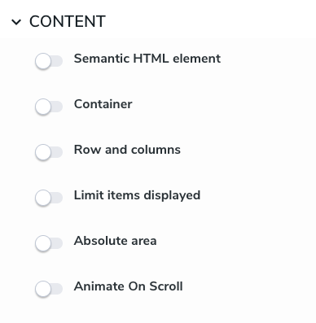
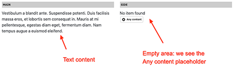

# Layout and Grid

Bootstrap's 12-column grid is the backbone of every page layout. In Jahia, it maps to a single **Grid** component that you compose with mixins to build anything from a full-width hero to a complex multi-column page.

The classic structure looks like this:

```html
<section id="my-section">
  <div class="container">
    <div class="row">
      <div class="col-md-8">Main content</div>
      <div class="col-md-4">Sidebar</div>
    </div>
  </div>
</section>
```



---

## How to build a layout

Add a **Grid** component and then enable the mixins you need. The most common setup:

| Step | Mixin | What it does |
|---|---|---|
| 1 | `bootstrap5mix:createSection` | Wraps everything in a semantic HTML5 element |
| 2 | `bootstrap5mix:createContainer` | Adds a Bootstrap container |
| 3 | `bootstrap5mix:createRow` | Adds a row and lets you choose columns |

---

## HTML5 Semantic Element (`bootstrap5mix:createSection`)

Wraps the grid in a meaningful HTML5 tag instead of a generic `<div>`.

| Property | Name | Description |
|---|---|---|
| **Element type** | `sectionElement` | `section`, `article`, `aside`, `header`, `footer`, `nav`, `main`, `figure`, `figcaption`, `hgroup`, or `div` |
| **ID** | `sectionId` | Optional `id` attribute (letters, digits, `-`, `_`) |
| **CSS class** | `sectionCssClass` | Optional `class` attribute |
| **Inline style** | `sectionStyle` | Optional `style` attribute |
| **Role** | `sectionRole` | Optional ARIA `role` attribute |
| **Aria label** | `sectionAria` | Optional `aria-label` attribute |

```cnd
[bootstrap5mix:createSection] mixin
  extends = bootstrap5nt:grid
  itemtype = content
  - sectionElement (string, choicelist[resourceBundle]) = 'div' autocreated indexed=no
    < 'section', 'article', 'aside', 'hgroup', 'header', 'footer', 'nav',
      'div', 'figure', 'figcaption', 'main'
  - sectionId       (string) indexed=no < '[a-zA-Z0-9-_]+'
  - sectionCssClass (string) indexed=no
  - sectionStyle    (string) indexed=no
  - sectionRole     (string) indexed=no
  - sectionAria     (string) indexed=no
```

---

## Container (`bootstrap5mix:createContainer`)

Adds a Bootstrap container inside the semantic element. Required if you want the grid to be centred and width-constrained.

| Property | Name | Description |
|---|---|---|
| **Container type** | `containerType` | Fixed width (`container`), full width (`container-fluid`), or responsive (`container-sm` → `container-xxl`) |
| **ID** | `containerId` | Optional `id` on the container |
| **CSS class** | `containerCssClass` | Extra classes on the container |

```cnd
[bootstrap5mix:createContainer] mixin
  extends = bootstrap5nt:grid
  itemtype = content
  - containerId      (string) < '[a-zA-Z0-9-_]+'
  - containerCssClass (string) indexed=no
  - containerType (string, choicelist[resourceBundle]) = 'container' autocreated indexed=no
    < 'container', 'container-fluid', 'container-sm', 'container-md',
      'container-lg', 'container-xl', 'container-xxl'
```

---

## Row and Columns (`bootstrap5mix:createRow`)

Adds a Bootstrap row and lets you choose the column layout.

| Property | Name | Description |
|---|---|---|
| **Grid type** | `typeOfGrid` | Empty row (no columns), predefined layout, or custom classes |
| **Row ID** | `rowId` | Optional `id` on the row |
| **Row CSS class** | `rowCssClass` | Extra classes on the row |
| **Vertical alignment** | `rowVerticalAlignment` | Aligns columns vertically: top, center, bottom |
| **Horizontal alignment** | `rowHorizontalAlignment` | Distributes columns: start, center, end, around, between, evenly |
| **Horizontal gutter** | `horizontalGutters` | Horizontal padding between columns: `gx-0` to `gx-5` |
| **Vertical gutter** | `verticalGutters` | Vertical padding between rows: `gy-0` to `gy-5` |

### Predefined layouts (`bootstrap5mix:predefinedGrid`)

Pick a ready-made column split — all sized for the medium breakpoint (≥768px):

| Value | Columns | Jahia area names |
|---|---|---|
| `12` | Single full-width column | `main` |
| `6_6` | Two equal columns | `main`, `side` |
| `4_4_4` | Three equal columns | `main`, `side`, `extra` |
| `3_3_3_3` | Four equal columns | `main`, `side`, `extra`, `extra2` |
| `4_8` | Sidebar left + main | `main`, `side` |
| `8_4` | Main + sidebar right | `main`, `side` |
| `3_9` | Small left + wide right | `main`, `side` |
| `9_3` | Wide left + small right | `main`, `side` |
| `3_6_3` | Narrow–wide–narrow | `side`, `main`, `extra` |
| `2_10` / `10_2` | Very narrow sidebar variants | `main`, `side` |
| `2_8_2` | Centred wide column | `side`, `main`, `extra` |

Example — choosing `3_6_3` generates:

```html
<div class="row">
  <div class="col-md-3">[side]</div>
  <div class="col-md-6">[main]</div>
  <div class="col-md-3">[extra]</div>
</div>
```

```cnd
[bootstrap5mix:predefinedGrid] > jmix:templateMixin mixin
  extends = bootstrap5nt:grid
  - grid (string, choicelist[gridTypeInitializer, resourceBundle]) = '4_8' autocreated indexed=no
    < '2_10', '3_9', '4_8', '4_4_4', '3_6_3', '3_3_3_3', '6_6', '8_4', '9_3', '10_2', '12'
```

### Custom grid (`bootstrap5mix:customGrid`)

Write your own Bootstrap column classes, **separated by commas** — one entry per column.

Example: `col col-md-8,col-6 col-md-4` generates:

```html
<div class="row">
  <div class="col col-md-8">[col1]</div>
  <div class="col-6 col-md-4">[col2]</div>
</div>
```

Jahia area names are `col1`, `col2`, `col3`, … You can nest grids inside grids for complex layouts.

```cnd
[bootstrap5mix:customGrid] > jmix:templateMixin mixin
  extends = bootstrap5nt:grid
  - gridClasses (string) = 'col col-md-8,col-6 col-md-4' indexed=no
```

---

## Limit the number of elements (`bootstrap5mix:listLimit`)

Prevents editors from dropping too many components into a column. Handy when a layout slot should only ever contain one image or one CTA button.



| Property | Name | Options |
|---|---|---|
| **Max elements** | `listLimit` | 1, 2, 3, 4, 5, 10, or no limit |

```cnd
[bootstrap5mix:listLimit] mixin
  extends = bootstrap5nt:grid
  itemtype = content
  - listLimit (string, choicelist[resourceBundle]) = '-1' autocreated indexed=no
    < '-1', '1', '2', '3', '4', '5', '10'
```

---

## Absolute areas (`bootstrap5mix:createAbsoluteAreas`)

Pulls content from a **parent page** rather than the current page. The classic use case is a footer that shows the same content across an entire section of the site.

The level refers to the page's depth in the tree:

| Level | Page |
|---|---|
| 0 | Home |
| 1 | First-level page |
| 2 | Second-level page |
| … | … |

Setting level to `0` means "always show the content defined on the home page", regardless of which page you're currently on. Absolute areas are highlighted in **red** in edit mode — to edit their content, navigate to the parent page where the content lives.

| Property | Name | Description | Default |
|---|---|---|---|
| **Level** | `level` | Which ancestor to inherit content from. | 0 |

```cnd
[bootstrap5mix:createAbsoluteAreas] mixin
  extends = bootstrap5nt:grid
  itemtype = content
  - level (string, choicelist[resourceBundle]) = '0' autocreated indexed=no
    < '0', '1', '2', '3', '4', '5'
```

---

## JS Rendering

| Source file | Registers |
|---|---|
| `bootstrap5-js-rendering/src/components/Grid/default.server.tsx` | `bootstrap5nt:grid` / `"default"` |

The JSP uses `template:include view="hidden.*"` to delegate column rendering to three separate sub-views. Since JS modules have no equivalent mechanism, all four JSPs (`grid.jsp` + the three `hidden` sub-views) are consolidated into a single TSX file.

**Three optional wrapper layers** (each gated by a mixin check):

| Mixin | Wrapper | Key props |
|---|---|---|
| `bootstrap5mix:createSection` | `<section>`, `<main>`, `<aside>`… | `sectionElement`, `sectionId`, `sectionCssClass`, `sectionStyle`, `sectionRole`, `sectionAria` |
| `bootstrap5mix:createContainer` | `<div class="container[-fluid]…">` | `containerType` deduplicated from `containerCssClass` |
| `bootstrap5mix:createRow` | `<div class="row…">` | `rowCssClass`, vAlign, hAlign, gX, gY — `"default"` sentinel stripped |

**Three column modes:**

| Mode | Columns | Area names |
|---|---|---|
| `bootstrap5mix:predefinedGrid` | `grid="4_8"` split on `_`, `col-md-{span}` | Computed by `predefinedAreaNames()`: `side`/`main`/`extra`/`extra2` based on proportions |
| `bootstrap5mix:customGrid` | `gridClasses` comma-split | `col0`, `col1`, … |
| *(none)* — nogrid | Single area | `"main"` (or node name inside `/modules`) |

`predefinedAreaNames()` mirrors the JSP `choose/when` logic exactly: `[4,8]` → `["side","main"]`, `[3,6,3]` → `["side","main","extra"]`, etc.

---

[← Back to README](../README.md)
