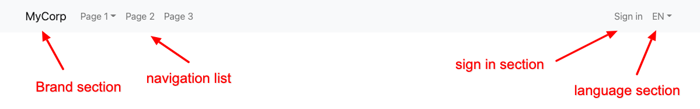
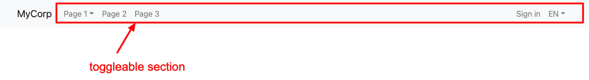
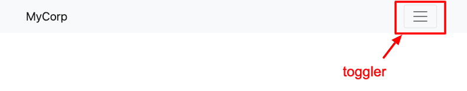
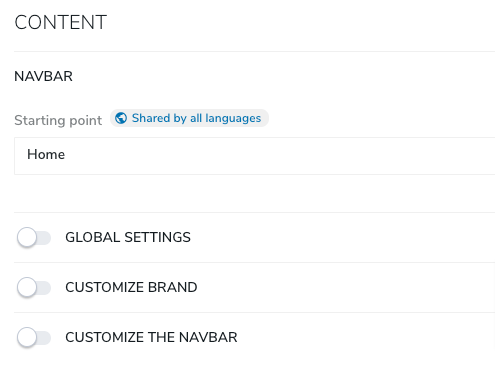
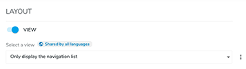

# Navbar

The navbar is a user interface component that provides simple navigation for your site. It includes options for branding, navigation, sign-in functionality, and language switching.

## Overview

The navbar consists of four distinct sections: brand, navigation, sign in, and language.



- The **brand** section displays a clickable logo and/or text that links to the starting page of your site.
- The **navigation** section presents a list of subpages and may include dropdown menus for deeper navigation.
- The **sign in** section allows anonymous users to sign in. Clicking on the sign-in button opens a modal with a login form. Once logged in, this section provides options to switch to edit mode or preview the page.
- The **language** section allows users to switch between different languages on the site.

On small devices, a toggle button is shown to display or hide these sections.



Here is an example of the toggle button on a small device:



In HTML, the navbar can be implemented as follows:

```html
<nav class="navbar navbar-expand-lg navbar-light bg-light">
    <div class="container">
        <!-- brand section -->
        <a class="navbar-brand" href="/fr/sites/mySite/home.html">MyCorp</a>

        <!-- toggler -->
        <button class="navbar-toggler navbar-toggler-right" type="button" data-bs-toggle="collapse"
                data-bs-target="#navbar-currentid" aria-controls="navbar-currentid" aria-expanded="false"
                aria-label="Toggle navigation">
            <span class="navbar-toggler-icon"></span>
        </button>

        <!-- toggleable section -->
        <div class="collapse navbar-collapse" id="navbar-currentid">
            <!-- navigation list -->
            <ul class="navbar-nav me-auto">
                <li class="nav-item "><a class="nav-link" href="/fr/sites/mySite/home/p1.html">Page 1</a></li>
                <li class="nav-item "><a class="nav-link" href="/fr/sites/mySite/home/page-2.html">Page 2</a></li>
                <li class="nav-item "><a class="nav-link" href="/fr/sites/mySite/home/page-3.html">Page 3</a></li>
            </ul>

            <!-- sign in section -->
            <ul class="navbar-nav ms-auto">
                <li class="nav-item">
                    <a data-bs-target="#login-modal" class="nav-link py-2 login" href="#" role="button" data-bs-toggle="modal" >
                        Sign in
                    </a>
                </li>
            </ul>
            <!-- modal login form -->
            <div class="modal fade" id="login-modal" tabindex="-1" aria-labelledby="login-modal-label" aria-hidden="true">
                [login form here]
            </div>

            <!-- language section -->
            <ul class="navbar-nav language-nav">
                <li class="nav-item dropdown">
                    <a href="#" class="dropdown-toggle nav-link" id="languageSwitchButton" data-bs-toggle="dropdown" aria-haspopup="true" aria-expanded="false" aria-label="Choose your preferred language" aria-owns="language-menu">
                        FR
                    </a>
                    <ul class="dropdown-menu" aria-labelledby="languageSwitchButton" role="menu" id="language-menu">
                        <li><a class="dropdown-item" title="English" href="[link-to-en]" role="menuitem" lang="en">English</a></li>
                        <li><a class="dropdown-item" title="Deutsch" href="[link-to-de]" role="menuitem" lang="en">Deutsch</a></li>
                    </ul>
                </li>
            </ul>
        </div>
    </div>
</nav>
```
## Properties

This component provides multiple levels of configurability. The mandatory property allows you to choose the start node, which is set to the home page by default but can be changed.

Here are the related properties:

| Label | Name | Description | Default Value |
| --- | --- | --- | --- |
| **Starting point** | `root` | Choose your starting point: Home, Current page, Parent page, or Custom page | Home |

- **Home**: The navigation list will display level 1 pages (the direct subpages of the home page).
- **Current Page**: The navigation list will display subpages of the current page.
- **Parent Page**: The navigation list will display sibling pages.
- **Custom Pages**: A page picker will be used to choose your starting page.

## Definition

```cnd
[bootstrap5mix:customRootPage] > jmix:templateMixin mixin
 extends = bootstrap5nt:navbar
 - customRootPage (weakreference, picker[type='page']) < 'jnt:page'

[bootstrap5nt:navbar] > jnt:content, bootstrap5mix:component, jmix:navMenuComponent
 - root (string, choicelist[navbarRootInitializer5,resourceBundle]) = 'homePage' autocreated indexed=no   < 'homePage', 'currentPage', 'parentPage','customRootPage'
```

Additionally, there are several advanced features available to customize your navbar:



You can enable the following mixins:

- Global settings: `bootstrap5mix:navbarGlobalSettings`
- Customize brand: `bootstrap5mix:brand`
- Customize the navbar: `bootstrap5mix:customizeNavbar`

## Global Settings

The `bootstrap5mix:navbarGlobalSettings` mixin provides the following global settings properties. You can enable or disable specific options based on the type of menu you want to use.

| Label | Name | Description | Default Value |
| --- | --- | --- | --- |
| Display the sign-in button | `addLoginButton` | Display a sign-in button for anonymous users that opens a modal with the sign-in form. Once logged in, a dropdown menu allows switching to edit and preview modes. | true |
| Maximum levels to display | `maxlevel` | Display subpages as a dropdown menu for levels greater than 1. | 2 |
| Display the languages | `addLanguageButton` | Display a language switch menu. The current language is displayed using the 2-character ISO code, and other languages are displayed using their translated names. | true |
| Wrap the navbar in a container | `addContainerWithinTheNavbar` | Wrap the content of the navbar in a container to center it on a page. This adds the `<div class="container">` inside the `nav` tag. | false |

### Global Settings Definition

```cnd
[bootstrap5mix:navbarGlobalSettings] mixin
 extends = bootstrap5nt:navbar
 itemtype = content
 - addLoginButton (boolean) = 'true' autocreated indexed=no
 - addLanguageButton (boolean) = 'true' autocreated indexed=no
 - maxlevel (string, choicelist[resourceBundle]) = '2' autocreated indexed=no < '1', '2', '3', '4', '5'
 - addContainerWithinTheNavbar (boolean) = 'false' autocreated indexed=no
```

Please note that the improved version of the document includes formatting enhancements, clearer descriptions, and reorganized sections for better readability.

## Customize Brand

The `bootstrap5mix:brand` mixin provides the following properties to customize the brand section:

| Label | Name | Description |
| --- | --- | --- | 
| Brand text | `brandText` | Set the text used in the brand section. | 
| Brand image | `brandImage` | Image used in the brand section. | 
| Brand image for small devices | `brandImageMobile` | Image used for small devices. |

These three properties can be set when using a navbar. Additionally, you can override these settings by editing the site node, typically if the navbar is included in a template set in the studio.

### Customize Brand Definition
```cnd
[bootstrap5mix:brand] mixin
 extends = bootstrap5nt:navbar
 - brandText (string) i18n
 - brandImage (weakreference, picker[type='image']) < 'jmix:image'
 - brandImageMobile (weakreference, picker[type='image']) < 'jmix:image'

[bootstrap5mix:siteBrand] mixin
 extends = jnt:virtualsite
 itemtype = content
 - brandText (string) i18n
 - brandImage (weakreference, picker[type='image']) < 'jmix:image'
 - brandImageMobile (weakreference, picker[type='image']) < 'jmix:image'
```

## Customize the Navbar

The following properties allow you to fully configure your navigation bar by setting CSS classes on different levels:

| Label | Name | Description | Default Value |
| --- | --- | --- | --- |
| Class(es) for the main nav | `navClass` | CSS classes to set on the main `<nav>` tag. | `navbar navbar-expand-lg navbar-light bg-light` |
| Class(es) for the toggle button | `togglerClass` | CSS classes to set on the `<button>` used as a toggler. | `navbar-toggler navbar-toggler-right` | 
| Class(es) for the brand link | `brandLinkClass` | CSS classes to set on the brand link. | `navbar-brand` |
| Class(es) for the toggleable section | `divClass` | CSS classes to set on the toggleable section (on the `nav > div` tag). | `collapse navbar-collapse` |
| Class(es) for the navigation list | `ulClass` | CSS classes to set on the navigation list. | `navbar-nav me-auto` |
| Class(es) for the sign-in section | `loginMenuULClass` | CSS classes to set on the sign-in section. | `navbar-nav ms-auto` |

### Definition of Customize the Navbar

```cnd
[bootstrap5mix:customizeNavbar] mixin
 extends = bootstrap5nt:navbar
 itemtype = content
 - navClass (string) = 'navbar navbar-expand-lg navbar-light bg-light' autocreated indexed=no
 - togglerClass (string) = 'navbar-toggler navbar-toggler-right' indexed=no
 - divClass (string) = 'collapse navbar-collapse' autocreated indexed=no
 - divClass (string) = 'collapse navbar-collapse' autocreated indexed=no
 - ulClass (string) = 'navbar-nav me-auto' autocreated indexed=no
 - loginMenuULClass (string) = 'navbar-nav ms-auto'
```

## Usage of the Dedicated View

In addition to its default usage, this component can be utilized with another existing view called "Only display the navigation list". This view is designed to exclusively show the navigation list without any additional elements.



By using this view, the generated HTML will solely consist of the navigation list. This can be particularly useful when incorporating the component in a footer section to display only the main sections of the website.

For example, the *Class(es) for the navigation list* is set to `footer-links`, and the *Display sub pages* is set to `false`. The resulting HTML code is as follows:

```html
<ul class="footer-link">
    <li class="nav-item">
        <a class="nav-link" href="/cms/render/default/en/sites/myCorp/home/page-1.html">Page 1</a>
    </li>
    <li class="nav-item">
        <a class="nav-link" href="/cms/render/default/en/sites/myCorp/home/page-2.html">Page 2</a>
    </li>
    <li class="nav-item">
        <a class="nav-link" href="/cms/render/default/en/sites/myCorp/home/page-3.html">Page 3</a>
    </li>
</ul>
```

[Back to README](../README.md)
