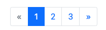
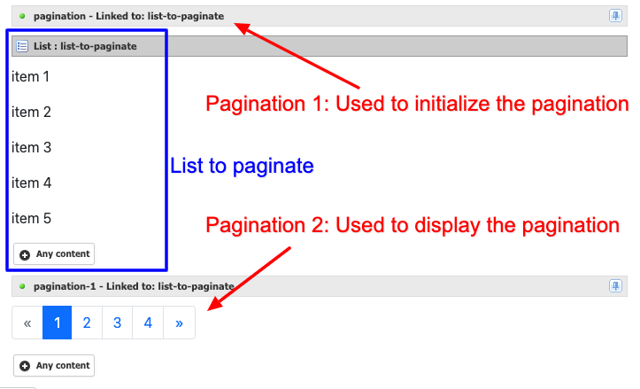

# Pagination

The Pagination component allows you to paginate long lists by indicating the existence of related content across multiple pages.



## Add Pagination Above Your List

Integrating pagination **above** a list in Jahia involves a few steps. Follow this animation to understand the process:

1. Add the pagination component after the Jahia content list you want to paginate.
2. Move the pagination component above your list.
3. Link (bind) the pagination to the list by clicking on the "pin" icon and selecting the list you want to link to.


## Add Pagination After Your List

To add pagination **after** your list, you can follow these steps:

1. Ensure that you already have a working pagination component above your list (refer to the previous example).
2. Copy the pagination component and paste it after your list.
3. Remove the pagination display from the first pagination component (the one above the list).



Here's an animation illustrating the process:


## Properties

The Pagination component in Jahia requires setup before the list you want to paginate, even if you intend to display the pagination bar after the list. Therefore, if you want to display the pagination bar after your list, you still need to include a component before it and choose not to display the pagination bar.

| Label | Name | Description | Default Value |
| --- | --- | --- | --- |
| Display the pagination | `displayPager` | Determines whether to display the pagination bar. If set to `false`, only initializes the pagination. | `true` |

## Advanced Properties

There are several advanced properties that you can set on the pagination bar. Note that if you want to display pagination after your list, you still need to set the same values on the pagination component (which is not displayed) before the list, particularly the Size of the menu and the number of items shown.

| Label | Name | Description | Default Value |
| --- | --- | --- | --- |
| How many items are shown | `pageSize` | Specifies the number of items shown on each page. | 10 |
| Size of the menu | `nbOfPages` | Determines the number of links to pages to display in the menu. In this example, the size is set to 3 even if there are more pages. | 10 |
| How many items are shown (edition mode) | `nbOfPagesInEdit` | Limits the number of items to show in edit mode. | 100 |
| Alignment | `align` | Defines the position of the pagination bar. It can be set to Start, Center, or End. | Center |
| Size | `layout` | Specifies the size of the pagination buttons. It can be set to smaller or larger than the default size. | Default |

## Definition

```cnd
[bootstrap5mix:advancedPagination] mixin
 extends = bootstrap5nt:pagination
 itemtype = content
 - pageSize (long) = '10' autocreated mandatory indexed=no
 - nbOfPages (long) = '10' autocreated mandatory indexed=no
 - nbOfPagesInEdit (long) = '100' autocreated mandatory indexed=no
 - align (string, choicelist[resourceBundle]) = 'justify-content-center' autocreated indexed=no  < 'justify-content-center', 'justify-content-start', 'justify-content-end'
 - layout (string, choicelist[resourceBundle]) = 'default' autocreated indexed=no   < 'pagination-lg', 'default', 'pagination-sm'


[bootstrap5nt:pagination] > jnt:content, bootstrap5mix:component, jmix:bindedComponent
 - displayPager (boolean) = 'true' autocreated indexed=no
```

[Back to README](../README.md)
