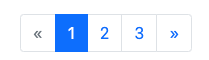

# Pagination

Splits a long content list across multiple pages and renders the navigation bar for moving between them.



> The Pagination component works alongside Jahia's **bound component** system — it must be linked to the list it paginates.

---

## How to set up pagination

Pagination always needs to be placed **before** the list in the page structure (even if you want it to appear after the list visually). Here's the recommended workflow:

### Pagination above the list


1. Add a **Pagination** component.
2. Drop your content list after it.
3. Click the **pin icon** on the Pagination component and select your list to bind them together.

### Pagination below the list


1. Set up pagination above your list first (as above).
2. **Copy** the Pagination component and paste it after the list.
3. On the first Pagination (above the list), uncheck **Display the pagination** — this one now only initialises the paging logic without rendering the bar.

---

## Properties

| Property | Name | Description | Default |
|---|---|---|---|
| **Display the pagination bar** | `displayPager` | Uncheck to initialise pagination without showing the bar (useful for the "above" hidden instance). | true |

---

## Advanced settings (`bootstrap5mix:advancedPagination`)

| Property | Name | Description | Default |
|---|---|---|---|
| **Items per page** | `pageSize` | How many list items to show on each page. | 10 |
| **Number of page links** | `nbOfPages` | How many page number links to show in the bar. | 10 |
| **Items per page (edit mode)** | `nbOfPagesInEdit` | Cap for edit mode — prevents loading huge lists while authoring. | 100 |
| **Alignment** | `align` | Position of the bar: Start, Center, or End. | Center |
| **Size** | `layout` | Smaller or larger buttons: `pagination-sm`, default, `pagination-lg`. | default |

> If you have two Pagination instances (one hidden above, one visible below), set **the same** `pageSize` and `nbOfPages` values on both.

```cnd
[bootstrap5nt:pagination] > jnt:content, bootstrap5mix:component, jmix:bindedComponent
  - displayPager (boolean) = 'true' autocreated indexed=no

[bootstrap5mix:advancedPagination] mixin
  extends = bootstrap5nt:pagination
  itemtype = content
  - pageSize       (long)   = '10'  autocreated mandatory indexed=no
  - nbOfPages      (long)   = '10'  autocreated mandatory indexed=no
  - nbOfPagesInEdit (long)  = '100' autocreated mandatory indexed=no
  - align   (string, choicelist[resourceBundle]) = 'justify-content-center' autocreated indexed=no
    < 'justify-content-center', 'justify-content-start', 'justify-content-end'
  - layout  (string, choicelist[resourceBundle]) = 'default' autocreated indexed=no
    < 'pagination-lg', 'default', 'pagination-sm'
```

---

## JS Rendering

| Fichier source | Enregistre |
|---|---|
| `bootstrap5-js-rendering/src/components/Pagination/default.server.tsx` | `bootstrap5nt:pagination` / `"default"` |

> **Statut : couche HTML uniquement.** Le markup Bootstrap (précédent/suivant, fenêtre de pages, page active) est implémenté. L'intégration fonctionnelle est bloquée sur des constructs Java sans équivalent JS connu :
>
> - `uiComponents:getBindedComponent()` — résolution du composant liste lié
> - `template:option` + `template:initPager` — initialisation de l'état du paginateur dans `moduleMap`
> - Params HTTP `begin{id}` / `end{id}` / `pagesize{id}` — page courante
>
> Le composant affiche un placeholder informatif en mode édition et ne rend rien en mode live tant que ces APIs ne sont pas disponibles côté moteur JS.

---

[← Back to README](../README.md)
