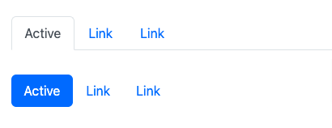
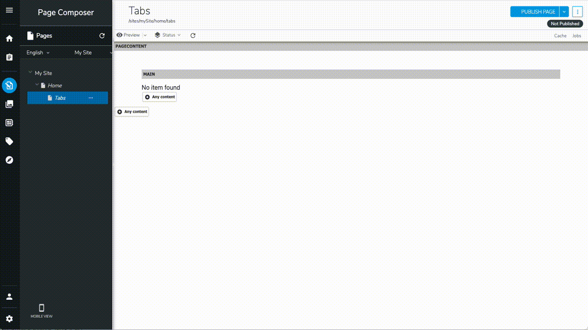
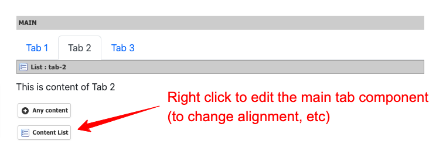
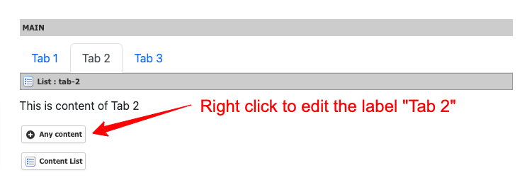

# Tabs and Pills

Bootstrap's tabs and pills are powerful navigation components that greatly improve website clarity and enhance the user experience.



## Tabs Properties

| Label | Name | Description | Default Value |
| --- | --- | --- | --- |
| Type | `type` | Determines the layout of the tabs. It can be "Tab" or "Pill". | Tab |
| Fade Effect | `fade` | Enables the fade-in effect for tabs. | true |
| Horizontal Alignment | `align` | Changes the horizontal alignment of the navigation. Options are Start, Center, End, Fill, and Justified. | Start |
| Use List Name as Anchor | `useListNameAsAnchor` | If enabled, the list name is used as the anchor. Otherwise, the UUID is used. | true |

## Adding a List of Tabs to Your Page

To add tabs or pills to your page, follow these steps:

1. Add the main tabs component.
2. Add as many content lists as you need. The title of each content list will be used as the tab label.
3. To add content to a specific tab, click on the tab and then add your content to the selected list.



## FAQ

### How to Change the Alignment or Type of Tabs After Creation?

To change the alignment or type of tabs after creating the main tabs component, follow these steps:

1. Right-click on the "Content List" button used to create a new tab entry.
2. Select "Edit" from the context menu.



### How to Change the Label of a Tab?

To change the label of a tab, follow these steps:

1. Right-click on the "+ Any Content" button of the respective list.
2. Select "Edit" from the context menu.



## Tabs Definition

Here is the definition of the tabs component:

```cnd
[bootstrap5nt:tabs] > jnt:content, bootstrap5mix:component, jmix:manuallyOrderable, jmix:list, jmix:siteContent, jmix:browsableInEditorialPicker orderable
- type (string, choicelist[resourceBundle, moduleImage='png']) = 'tab' autocreated indexed=no < 'tab', 'pill', 'link'
- fade (boolean) = 'true' autocreated indexed=no
- align (string, choicelist[resourceBundle,moduleImage='svg']) = 'justify-content-start' indexed=no < 'justify-content-start', 'justify-content-center', 'justify-content-end', 'nav-fill', 'nav-justified'
- useListNameAsAnchor (boolean) = 'true' autocreated indexed=no
+ * (jnt:contentList) = jnt:contentList
```

[Back to README](../README.md)
