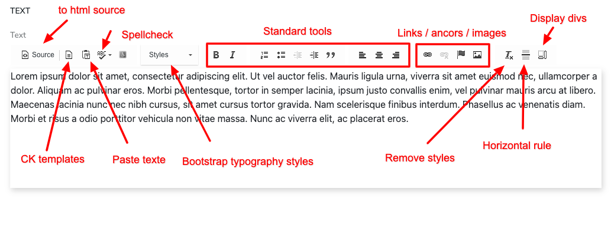

# Text

The **Text** component provides Bootstrap 5 styles and CKEditor templates to enhance the text formatting capabilities within Jahia.

It includes a custom configuration of CKEditor tailored for Bootstrap 5, featuring:

- A curated set of **Bootstrap typography styles**
- A **lightweight custom toolbar**
- Useful **CK templates** for quick layout insertion
- **Standard formatting tools**
- A **format remover** button
- A **"Wash" button** to clean up pasted content and keep only pure HTML

---

## Toolbar

The following image shows the custom toolbar used for the `bootstrap5mix:text` mixin:



The toolbar includes:

- **Standard formatting tools** (bold, italic, lists, links, alignment, etc.)
- A **“Remove Format”** button to strip all visual formatting from selected text
- A **“Wash” button** that cleans the HTML code by removing unnecessary styles and tags, especially useful when pasting content from Microsoft Word or similar editors

---

## CK Templates

The Text component provides a set of CKEditor templates accessible via the **Template** button. These templates insert pre-formatted content at the cursor position.

Available templates include:

- Code blocks
- Alerts (various Bootstrap alert colors)
- Tables
- Description lists
- Blockquotes
- Jumbotron sections

---

## CK Styles

The **Styles** dropdown offers a wide range of predefined Bootstrap-based formats you can apply to selected text:

- **Headings** (H1 to H6)
- **Lead text**
- **Highlighted / Colored text**
- **Deleted / Inserted / Fine print**
- **Underlined / Bold / Italic**
- **Blockquotes**
- **Inline and block code**
- **Variables / User input / Sample output**
- **Text colors**
- **Background colors**
- **Alerts and Badges**
- **Pill and Preformatted text**

These styles help maintain consistency with Bootstrap 5 theming.

---

## Property

The Text component exposes the following property:

| Label | Name  | Description                            |
|-------|-------|----------------------------------------|
| Text  | `text` | Rich text field with i18n support      |

---

## Definition

Here is the CND definition of the Text component:

```cnd
[bootstrap5mix:text] mixin
 - text (string, richtext[ckeditor.toolbar='Tinny',ckeditor.customConfig='$context/modules/bootstrap5-components/javascript/ckconfig.js']) i18n

[bootstrap5nt:text]> jnt:content, bootstrap5mix:component, bootstrap5mix:text