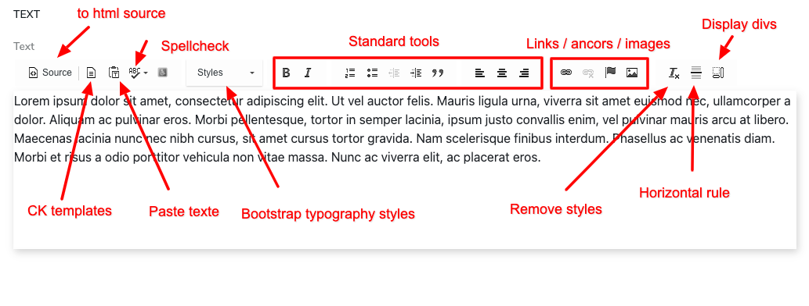

# Text

A rich-text component powered by CKEditor, pre-configured with Bootstrap 5 styles, templates, and a few extras to keep your content clean.



---

## What's special about this text component?

The toolbar is trimmed down and Bootstrap-aware — you get exactly what you need without the clutter of a full word processor. A few highlights:

- **Bootstrap styles** — headings, lead text, alerts, badges, code blocks, and more are one click away in the Styles dropdown
- **CK Templates** — inserts pre-built Bootstrap snippets (tables, blockquotes, jumbotrons, alerts…) at the cursor
- **Remove Format** — strips all inline formatting from selected text in one click
- **Wash** — deep-cleans pasted HTML from Microsoft Word or Google Docs, keeping only the semantic tags

---

## Toolbar overview

| Button group | What it includes |
|---|---|
| **Formatting** | Bold, italic, underline, strikethrough, subscript, superscript |
| **Structure** | Headings (H1–H6), paragraph, blockquote |
| **Lists** | Ordered and unordered lists, indent/outdent |
| **Insert** | Links, images, tables, special characters, horizontal rule |
| **Bootstrap styles** | Dropdown with all Bootstrap text/background/component classes |
| **Templates** | Bootstrap code snippets |
| **Clean up** | Remove Format, Wash |

---

## Available Bootstrap styles (Styles dropdown)

- Headings H1–H6 and lead text
- Highlighted, coloured, and muted text
- Deleted, inserted, fine print, underlined
- Blockquotes (standard and Bootstrap 5 `<blockquote class="blockquote">`)
- Inline code and block code
- Variables, user input, sample output
- Bootstrap text colours and background colours
- Alerts and badges
- Pill and preformatted text

---

## Property

| Name | Type | Description |
|---|---|---|
| `text` | richtext (i18n) | The rich-text content, stored as HTML. |

```cnd
[bootstrap5mix:text] mixin
  - text (string, richtext[ckeditor.toolbar='Tinny',
      ckeditor.customConfig='$context/modules/bootstrap5-components/javascript/ckconfig.js']) i18n

[bootstrap5nt:text] > jnt:content, bootstrap5mix:component, bootstrap5mix:text
```

---

## Using `bootstrap5mix:text` in your own components

You can reuse the rich-text mixin in a custom node type to get the Bootstrap-aware CKEditor toolbar automatically:

```cnd
[mymodule:myComponent] > jnt:content, bootstrap5mix:component, bootstrap5mix:text
  - myTitle (string) i18n
```

Then in your JSP view, output the content unescaped (it's already sanitized by CKEditor):

```jsp
<c:set var="text" value="${currentNode.properties['text'].string}"/>
<c:if test="${not empty text}">
    <div>${text}</div>
</c:if>
```

---

## JS Rendering

| Source file | Registers |
|---|---|
| `bootstrap5-js-rendering/src/components/Text/default.server.tsx` | `bootstrap5nt:text` / `"default"` |

Reads the `text` property via `currentNode.getProperty("text").getString()` and injects it via `dangerouslySetInnerHTML` — identical to the JSP which outputs `${currentNode.properties.text.string}` unescaped.

---

[← Back to README](../README.md)
