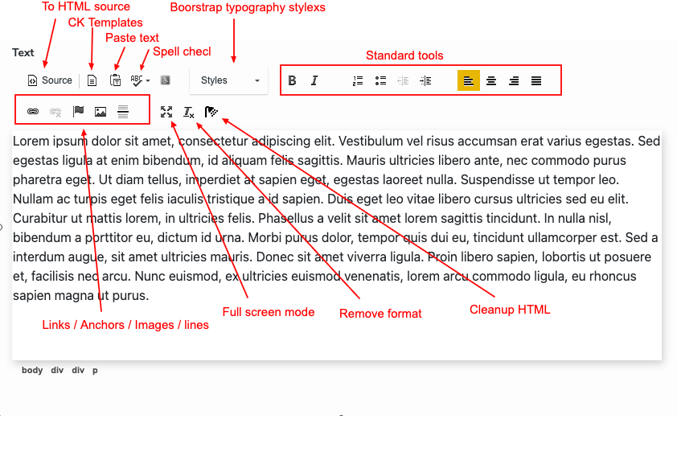

# Text

The Text component provides Bootstrap 5 styles and CK templates to enhance the text formatting capabilities.

The Bootstrap 5 components include a custom configuration for the CK Editor. This configuration offers a selection of main Bootstrap typography styles, a custom light toolbar, and some useful CK templates.

## Toolbar

The following image shows the custom toolbar used for the `bootstrap5mix:text` mixin:



## CK Templates

The Text component provides a set of CK templates that can be accessed directly from the template button. These templates allow you to quickly insert pre-formatted code into the text area at the cursor position. The available CK templates include:

- Code blocks
- Alerts (in different colors)
- Table
- Description list
- Blockquote
- Jumbotron

## CK Styles

The Text component also offers a range of common styles that can be applied using the style dropdown. These styles include:

- Heading H1 to H6
- Lead Text
- Highlight Text
- Deleted Text
- No Longer Accurate
- Addition to the Document
- Underlined
- Fine Print
- Bold Text
- Italicized Text
- Inline Code
- Code Blocks
- Blockquotes
- Variables
- User Input
- Sample Output
- Colored Text
- Colored Background
- Alerts
- Badges
- Pill
- Pre

## Property

The Text component has the following property:

| Label | Name | Description |
| --- | --- | --- |
| Text | `text` | Rich text with internationalization support |

## Definition

Here is the definition of the Text component:

```cnd
[bootstrap5mix:text] mixin
 - text (string, richtext[ckeditor.toolbar='Tinny',ckeditor.customConfig='$context/modules/bootstrap5-components/javascript/ckconfig.js']) i18n

[bootstrap5nt:text]> jnt:content, bootstrap5mix:component, bootstrap5mix:text
```

## Usage of the Mixin

The mixin `bootstrap5mix:text` can be used like any other mixin in your custom definition. It provides you with the custom toolbar. To display the value of the `text` property, you can retrieve the string value as follows:

```jsp
${currentNode.properties.text.string}
```

[Back to README](../README.md)

